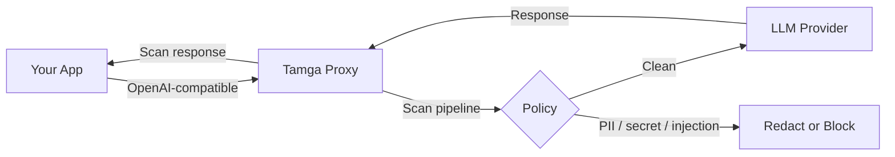

<div align="center">
  

  <h1>Tamga</h1>

  <p>
    <b>Self-hosted LLM security proxy for regulated industries.</b><br/>
    Blocks PII, secrets, and prompt injection before the request reaches
    the model — built for banks, healthcare, and other KVKK/GDPR/HIPAA
    workloads.
  </p>

  <!-- TODO: replace docs/incidents.png with docs/demo.gif when the demo recording is ready -->
  

  <p>
    <a href="CHANGELOG.md"></a>
    <a href="LICENSE"></a>
    <a href="https://pkg.go.dev/github.com/yatuk/tamga"></a>
    <a href="proxy/go.mod"></a>
    <a href="tests/stress/baseline.json"></a>
  </p>

  <p>
    <a href="#quick-start">Quick Start</a> ·
    <a href="#how-it-works">How It Works</a> ·
    <a href="#how-tamga-compares">vs Alternatives</a> ·
    <a href="#whats-real-vs-planned">Roadmap</a>
  </p>
</div>

---

## Quick Start

```bash
git clone https://github.com/yatuk/tamga.git
cd tamga
cp .env.example .env          # add ANTHROPIC_API_KEY / OPENAI_API_KEY

cd deploy
docker compose up -d
```

Dashboard at http://localhost:3000 · Proxy at http://localhost:8443

Send a prompt carrying a Turkish national ID and watch it get blocked
before it ever reaches the provider:

```bash
curl -s -o /dev/null -w "%{http_code}\n" \
  -X POST http://localhost:8443/v1/chat/completions \
  -H "Content-Type: application/json" \
  -d '{"model":"gpt-4o-mini","messages":[{"role":"user","content":"Müşteri TC 12345678950"}]}'
# 403  — PII blocked (tc_kimlik)
```

Liveness check: `curl http://localhost:8443/health`. Full operator reference
in [docs/operations.md](docs/operations.md).

---

## Why?

Employees in regulated industries paste customer data into ChatGPT every
day — TC Kimlik numbers, IBANs, credit card details. In banking, KVKK fines
start at 1.8M TL per incident.

The existing options don't fit:

- **Traditional DLP** can't see the semantic content of an HTTPS request to
  an LLM API — it inspects packets, not intent.
- **Cloud LLM gateways** (Lakera, Portkey) send your prompts to their
  servers. For KVKK Art. 9 data residency, that's a non-starter.
- **Provider guardrails** (OpenAI Moderation) are locked to one provider,
  shallow, and leave no audit trail your regulator will accept.

Tamga sits between your app and OpenAI / Anthropic / Azure as a self-hosted
reverse proxy. Every prompt is scanned before it leaves your network; every
response is scanned before it reaches your user.

Built by a bank SOC intern who watched this problem happen daily.

---

## How It Works



Tamga speaks the OpenAI API — your existing SDK code works unchanged, you
just point `base_url` at Tamga instead of `api.openai.com`. Every request
runs through seven inline scanners — three core (PII, secrets, prompt
injection) plus jailbreak, content moderation, custom entities, and
competitor mentions — with optional deep analysis for ambiguous cases.

Latency: scan stage p95 0.52ms; end-to-end overhead p95 5.5ms at 100 RPS on
consumer hardware. Full numbers and all six architecture diagrams in
[benchmarks](docs/benchmarks/README.md) and
[architecture](docs/architecture/README.md).

---

## What's Real vs Planned

### Working today (v0.7.0)

- Seven inline scanners — PII (TC Kimlik, IBAN, credit card), secrets (API
  keys, tokens), prompt injection, jailbreak, content moderation, custom
  entities, competitor mentions
- YAML policy engine with hot reload — BLOCK, REDACT, WARN, PASS
- OpenAI-compatible API for all major providers (OpenAI, Anthropic, Azure,
  Vertex, Bedrock, Mistral)
- PostgreSQL audit log with hash-chain integrity
- Next.js dashboard with incident queue, cost control, OWASP coverage
- Docker Compose, Helm, and Terraform deployment; Python and TypeScript SDKs
- 62 published adversarial test vectors — 29 currently bypass, tracked in
  [tests/stress/baseline.json](tests/stress/baseline.json)

### Coming next (v0.8.0, Q3 2026)

- Operator-state scanner —
  [jugeni](https://github.com/jugeni/jugeni-contracts) integration for
  pre-call decision governance
- Encrypted vault for PII — redact-then-restore round-trip
- Custom entity UI — define your own PII patterns from the dashboard
- Trend graphs and incident analytics

### Roadmap (v0.9+)

- Semantic caching for cost reduction
- Multi-language expansion — Arabic and Persian patterns
- Canary tokens for system prompt leak detection
- MCP gateway integration

Full roadmap: [docs/TAMGA_ROADMAP_MASTER.md](docs/TAMGA_ROADMAP_MASTER.md) ·
[CHANGELOG.md](CHANGELOG.md)

---

## How Tamga Compares

| Capability | Tamga | Cloud Gateways | Traditional DLP |
|---|---|---|---|
| Self-hosted, data stays on-prem | Yes | No | Yes |
| Semantic PII detection | Yes | Yes | Limited (regex only) |
| Turkish / multilingual patterns | Yes | Limited | No |
| Regulator-grade audit log | Yes | Managed only | Some |
| Open source | Yes (AGPL) | No | Mostly no |
| Published adversarial dataset | Yes (62 vectors) | No | No |

Full column-by-column comparison in [docs/comparison.md](docs/comparison.md).

---

## Compliance

Tamga provides technical controls mapped to KVKK, GDPR, BDDK, and the OWASP
LLM Top 10. Because it is self-hosted, personal data never leaves your
network — the foundation for data-residency requirements. Auditors get
evidence-grade, hash-chained audit logs and regulator-ready mappings.

Full mappings: [docs/compliance/](docs/compliance/).

---

## Companion Projects

**[jugeni](https://github.com/jugeni/jugeni-contracts)** by Mike Czerwiński —
a persistent operator-state framework. Tamga consumes jugeni's audit log for
pre-call decision governance (v0.8.0). See the
[integration guide](docs/integrations/jugeni.md).

**[MCPRadar](https://github.com/yatuk/mcpradar)** — a pre-deployment security
scanner for MCP servers. Run it before adding an MCP server to your stack;
Tamga runs inline once it's deployed. Static analysis to Tamga's runtime
defense — defense in depth.

---

## Community & Support

- Report a bug — [github.com/yatuk/tamga/issues](https://github.com/yatuk/tamga/issues)
- Ask or discuss — [github.com/yatuk/tamga/discussions](https://github.com/yatuk/tamga/discussions)
- Security disclosures — [SECURITY.md](SECURITY.md)
- Interested in a pilot? — [docs/PILOT.md](docs/PILOT.md)
- Contributing — [CONTRIBUTING.md](CONTRIBUTING.md)
- Docs — [architecture](docs/architecture/README.md) · [operations](docs/operations.md) · [development](docs/development.md) · [use cases](docs/use-cases.md) · [FAQ](docs/faq.md)

---

## License

Tamga is open-core: the core proxy, scanners, and dashboard are
[AGPL-3.0](LICENSE). Enterprise features (multi-region, SSO, advanced RBAC,
SLA support) are under a separate
[commercial license](LICENSE-COMMERCIAL.md).

---

<div align="center">

<a href="https://www.star-history.com/#yatuk/tamga&Date">
  <picture>
    <source media="(prefers-color-scheme: dark)" srcset="https://api.star-history.com/svg?repos=yatuk/tamga&type=Date&theme=dark" />
    
  </picture>
</a>

<sub>© 2026 Fatih Serdar Çakmak</sub>

</div>
