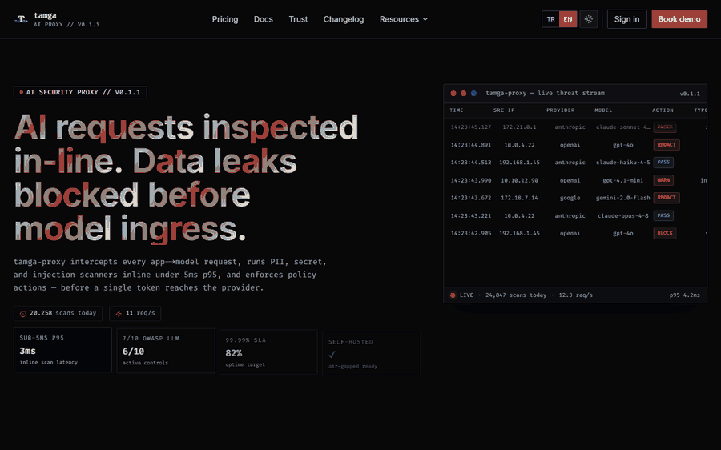
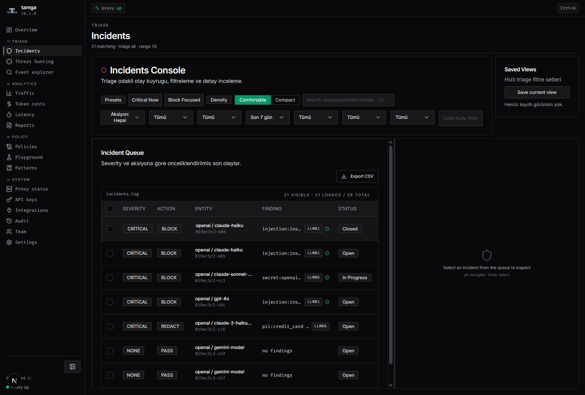
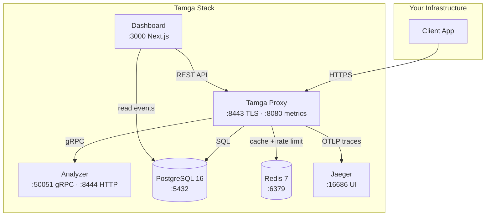
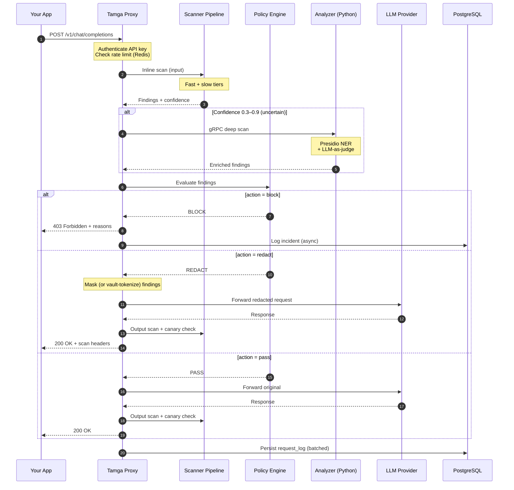
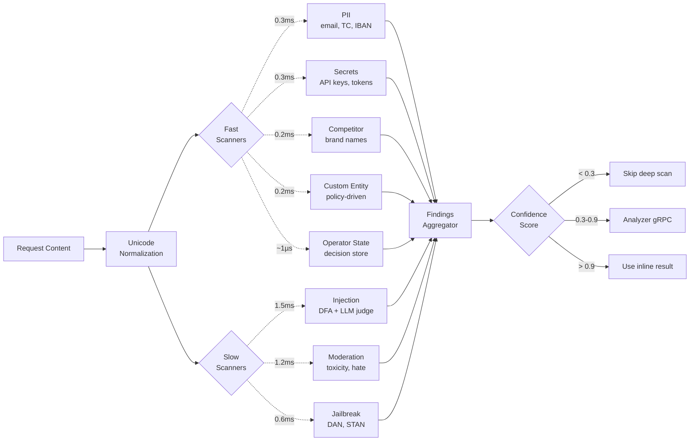
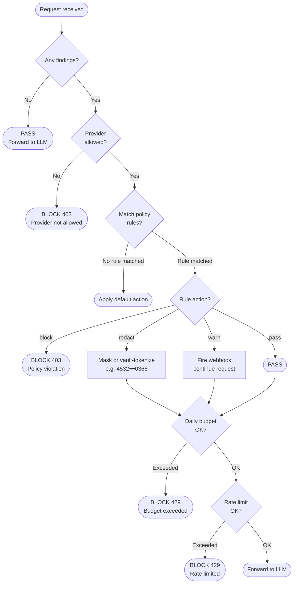
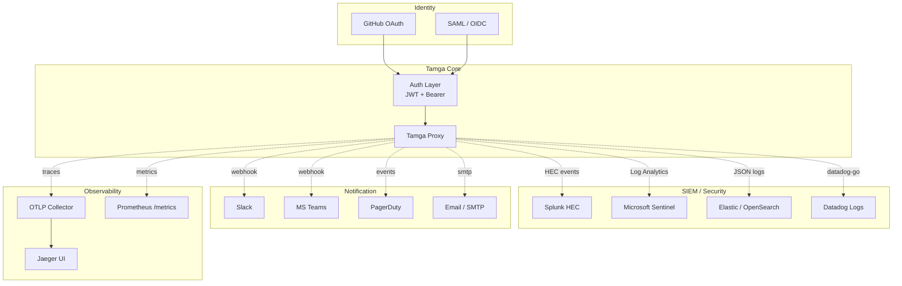
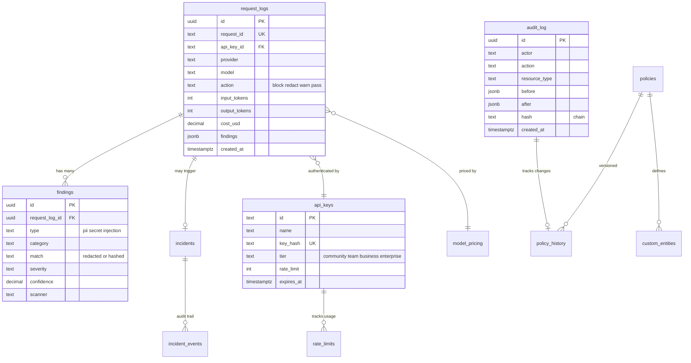

<div align="center">

  

  <h1>Tamga</h1>

  <p>
    <b>Self-hosted LLM security proxy for regulated industries.</b><br/>
    Blocks PII, secrets, and prompt injection before the request reaches
    the model — built for banks, healthcare, and other KVKK/GDPR/HIPAA
    workloads.
  </p>

  <p>
    <a href="CHANGELOG.md"></a>
    <a href="LICENSE"></a>
    <a href="https://pkg.go.dev/github.com/yatuk/tamga"></a>
    <a href="proxy/go.mod"></a>
    <a href="tests/stress/baseline.json"></a>
    <a href="https://tamgaproxy.com"></a>
  </p>

  <p>
    <a href="#quick-start">Quick Start</a> ·
    <a href="#how-it-works">How It Works</a> ·
    <a href="#benchmarks">Benchmarks</a> ·
    <a href="#how-tamga-compares">vs Alternatives</a> ·
    <a href="#whats-real-vs-planned">Roadmap</a> ·
    <a href="https://tamgaproxy.com">Website</a>
  </p>

  

</div>

---

## What is Tamga?

Tamga sits between your application and LLM providers (OpenAI, Anthropic,
Azure, Vertex, Bedrock, Mistral), scanning every prompt and response in real
time and enforcing your security policy before data leaves your network.

| Your challenge | Tamga's answer |
|:---|:---|
| PII leaking through prompts | Detect and **REDACT** credit cards, TC Kimlik, IBAN, email, phone before they reach the provider |
| API keys pasted into chat | **BLOCK** secrets (AWS, GitHub, OpenAI keys, JWT, connection strings) inline |
| Prompt injection attacks | Pattern-based injection and jailbreak detection with configurable sensitivity |
| System prompt exfiltration | **Canary tokens** — an invisible marker in the system prompt; if it comes back, the prompt leaked |
| Redaction destroys usefulness | **Vault** — reversible tokenization, so the user still gets real data back |
| Zero visibility into AI usage | Event bus, PostgreSQL audit log, REST API, and a full dashboard |
| Scattered policies per app | One YAML policy file: hot-reload, API-managed, version-controlled |

> **Tamga is provider-agnostic.** Your team keeps using whichever LLM API they
> prefer — Tamga enforces policy transparently in front of it.

**Latency.** Sub-millisecond static scanning via an Aho-Corasick DFA. Scan-stage
p95 is **0.52 ms**; end-to-end proxy overhead p95 is **5.5 ms** at 100 RPS on
consumer hardware. See [benchmarks](#benchmarks).

<div align="center">
  
  <p><sub>The incident queue: every blocked prompt, with the rule that fired and the evidence behind it.</sub></p>
</div>

---

## Why?

Employees in regulated industries paste customer data into ChatGPT every
day — TC Kimlik numbers, IBANs, credit card details. In banking, KVKK fines
start at 1.8M TL per incident.

The existing options don't fit:

- **Traditional DLP** can't see the semantic content of an HTTPS request to
  an LLM API — it inspects packets, not intent.
- **Cloud LLM gateways** (Lakera, Portkey) send your prompts to their
  servers. For KVKK Art. 9 data residency, that's a non-starter.
- **Provider guardrails** (OpenAI Moderation) are locked to one provider,
  shallow, and leave no audit trail your regulator will accept.

Tamga sits between your app and OpenAI / Anthropic / Azure as a self-hosted
reverse proxy. Every prompt is scanned before it leaves your network; every
response is scanned before it reaches your user.

Built by a bank SOC intern who watched this problem happen daily.

---

## Quick Start

### 1. Clone and configure

```bash
git clone https://github.com/yatuk/tamga.git
cd tamga
cp .env.example .env          # add ANTHROPIC_API_KEY / OPENAI_API_KEY
```

### 2. Launch the stack

```bash
cd deploy
docker compose up -d
```

Dashboard at http://localhost:3000 · Proxy at http://localhost:8443

### 3. Verify

Send a prompt carrying a Turkish national ID and watch it get blocked before
it ever reaches the provider:

```bash
curl -s -o /dev/null -w "%{http_code}\n" \
  -X POST http://localhost:8443/v1/chat/completions \
  -H "Content-Type: application/json" \
  -d '{"model":"gpt-4o-mini","messages":[{"role":"user","content":"Müşteri TC 12345678950"}]}'
# 403  — PII blocked (tc_kimlik)
```

```bash
# Liveness (no auth)
curl -s http://localhost:8443/health

# Detailed health: proxy, DB, scanner count, uptime
curl -s http://localhost:8443/api/v1/health/detailed | jq .
```

No provider keys handy? Set `TAMGA_MOCK_UPSTREAM=true` to run the whole stack
against a mock upstream. Full operator reference in
[docs/operations.md](docs/operations.md).

### Point your SDK at Tamga

Tamga speaks the OpenAI API — existing SDK code works unchanged:

```python
from openai import OpenAI

client = OpenAI(
    base_url="http://localhost:8443/v1",   # was https://api.openai.com/v1
    api_key=os.environ["OPENAI_API_KEY"],
)
```

---

## Production Deployment

For Kubernetes clusters:

```bash
helm install tamga ./deploy/helm/tamga-proxy -n security --create-namespace
```

Edit `values.yaml` to configure providers, resource limits, and autoscaling.
The chart ships network policies, pod disruption budgets, and
PodSecurityContext defaults. Terraform (AWS) modules live in `deploy/`.

Six services run on an internal bridge network. Only the proxy (`:8443`) and
dashboard (`:3000`) are exposed externally; all inter-service traffic stays
inside the Docker network namespace.



<details>
<summary><strong>Component details</strong></summary>

| Component | Language | Role | Port |
|---|---|---|---|
| **Proxy** | Go | Inline scanners, policy engine, reverse proxy, rate limiter, REST API | `8443` |
| **Analyzer** | Python | Deep PII/injection/toxicity analysis, compliance reports | `8444` |
| **Dashboard** | Next.js | Admin UI, incident hunting, integrations, OWASP coverage | `3000` |
| **PostgreSQL** | — | Persistent telemetry and audit storage (optional) | `5432` |
| **Redis** | — | Rate limiting, caching, distributed counters | `6379` |
| **Jaeger** | — | OpenTelemetry tracing (optional) | `16686` |

</details>

---

## How It Works

Tamga speaks the OpenAI API — you just point `base_url` at Tamga instead of
`api.openai.com`. Every request runs through the inline scanner pipeline, then
the policy engine decides: pass, redact, warn, or block.

### Request lifecycle



Typical latency: 3–8 ms scan plus provider latency (usually 500–3000 ms), so
Tamga is under 2% of total request time.

Diagram sources: [D2](docs/architecture/request-lifecycle.d2) ·
[SVG](docs/architecture/request-lifecycle.svg) ·
[full architecture](docs/architecture/README.md).

### Scanner pipeline

Inline scanners run on every request. Hybrid design: fast scanners run
sequentially to avoid goroutine overhead, while slower scanners run in
parallel to hide their 1–2 ms latency.



Normalization strips the usual evasion tricks before matching: NFKC, homoglyph
folding, and zero-width character removal.

### Policy decisions

Decision order matters — the earliest deny wins.



| # | Check | If it fails | Action |
|---|---|---|---|
| 1 | Provider allowed? | Not in allowlist | `BLOCK 403` |
| 2 | Policy rules matched? | No rule | Default |
| 3 | Rule action = block? | Critical PII / secret | `BLOCK 403` |
| 4 | Rule action = redact? | Mask and continue | `REDACT` |
| 5 | Rule action = warn? | Fire webhook | `WARN` + pass |
| 6 | Daily budget OK? | Exceeded | `BLOCK 429` |
| 7 | Rate limit OK? | Exceeded | `BLOCK 429` |
| 8 | Default | — | `PASS` |

---

## Features

| Category | Capability | Action |
|---|---|---|
| **PII Detection** | Credit card, TC Kimlik, IBAN, email, phone, IP — supports KVKK, GDPR, and PCI-DSS by keeping raw PII/PCI inside your perimeter | `BLOCK` / `REDACT` |
| **Secret Detection** | AWS/GitHub/OpenAI keys, JWT, private keys, connection strings | `BLOCK` |
| **Injection Detection** | Prompt injection, jailbreak, DAN-style attacks | `BLOCK` |
| **Canary Tokens** | Invisible marker injected into the system prompt; detects system-prompt leakage in the response | `BLOCK` |
| **Vault** | Reversible PII tokenization — placeholders out, real values restored on the way back | `REDACT` |
| **Operator State** | Pre-call decision governance against a jugeni audit log (locked decisions, stale locks, authorization) | `BLOCK` / `WARN` |
| **Custom Entities** | Regex-defined patterns (customer IDs, file numbers), editable from the dashboard | `REDACT` / `WARN` |
| **Competitor Watch** | Detect competitor mentions in prompts | `WARN` |
| **Rate Limiting** | Per-API-key token bucket (requests/min, tokens/day) | `BLOCK` |
| **Provider Control** | Allow/block specific LLM providers per policy | — |
| **Body Limits** | Per-provider request size caps with `413` response | — |
| **Policy Hot-Reload** | Edit YAML, reload in place or via `POST /api/v1/policies/reload` | — |
| **Event Bus** | Buffered pub/sub for metrics, logs, alerts, DB | async |
| **REST API** | Stats, events, health, policy management | `:8443/api/v1` |
| **Audit Logging** | PostgreSQL persistence with hash-chained request telemetry | — |
| **OpenTelemetry** | Jaeger tracing integration | optional |
| **Mock Upstream** | Demo mode without real provider keys | `TAMGA_MOCK_UPSTREAM=true` |

---

## Benchmarks

All accuracy numbers are reproducible from a single command
(`go run ./cmd/redteam`) against a public 309-prompt adversarial corpus. The
same corpus gates CI — it is not a marketing dataset, and we do not tune
patterns against it between runs.

| Metric | Value | Notes |
|---|---|---|
| **Precision** | **0.969** | Of the prompts Tamga mitigated, 96.9% were genuinely adversarial — this governs the false-positive rate |
| **Recall** | **0.484** | The deterministic DFA catches ~48% alone; the rest are built to require semantic reasoning |
| **F1** | **0.646** | Harmonic mean of the two |
| **Scan latency p95** | **0.52 ms** | Single request, commodity hardware |
| **Scan latency p99** | **0.58 ms** | Worst case on the deterministic hot path |
| **Scan latency max** | **0.77 ms** | Well under the 5 ms budget |
| **Corpus** | **309 prompts** | ~40% benign, 60% adversarial/PII/secret |

### Load performance

k6 benchmarks on a single-process Go proxy, 4-core consumer CPU, 16 GB RAM,
NVMe SSD. No GPU, no SIMD tuning. Scripts in `tests/stress/k6/`.

| Workload | RPS | P95 | Errors |
|---|---|---|---|
| Clean prompts | 100 | 5.5 ms | 0% |
| Clean prompts | 500 | 3.7 ms | 0% |
| Clean prompts | 1000 | 130 ms | 0% (WARN) |

> **How to read this.** P95 at 100–500 RPS reflects normal operating
> conditions. The spike at 1000 RPS is Go GC and goroutine scheduling on
> consumer hardware; deployments with tuned GC (`GOGC=50`) and dedicated CPUs
> stay well under it.

Full report: [docs/benchmarks/](docs/benchmarks/README.md) ·
[red team corpus](proxy/testdata/redteam/prompts.csv)

---

## Security Testing & Adversarial Coverage

Tamga publishes its own failures. The stress suite runs adversarial bypass
attempts and load thresholds on every PR, and a regression gate blocks changes
that degrade detection or performance.

| Category | Vectors | Detected | Bypassed |
|---|---|---|---|
| PII | 17 | 6 | 11 |
| Injection | 22 | 9 | 13 |
| Secret | 12 | 8 | 4 |
| Policy | 11 | 10 | 1 |
| Operator state | 7 | 6 | 1 |
| **Total** | **69** | **39** | **30** |

Those 30 bypasses are real and tracked in
[tests/stress/baseline.json](tests/stress/baseline.json). They are mostly
semantic attacks — ROT13, "grandma" framings, homoglyphs, fictional
scenarios — which the deterministic hot path is not designed to catch alone.
Publishing them is the point: a security tool that only reports its wins
isn't giving you a threat model.

```bash
cd tests/stress && ./run_stress_suite.sh   # requires Docker
```

Details: [tests/stress/README.md](tests/stress/README.md)

---

## How Tamga Compares

| Capability | Tamga | Cloud Gateways | OSS Gateways | Legacy DLP |
|---|---|---|---|---|
| Self-hosted, data stays on-prem | Yes | No | Yes | Yes |
| Turkish PII (TCKN, IBAN, VKN) | Native | Partial | No | Partial |
| KVKK / BDDK mapping | Documented | No | No | Partial |
| Inline PII redaction (sub-ms) | Yes | Yes | Tier-gated | HTTPS only |
| Reversible tokenization (vault) | Yes | Partial | No | Some |
| Multi-provider routing | Yes | Yes | Yes | No |
| Hash-chain audit logs | Yes | No | Partial | Some |
| Open source | Yes (AGPL-3.0) | No | Yes (MIT) | Mostly no |
| Published adversarial dataset | Yes (69 vectors) | No | No | No |
| Stress-test CI gate | Yes, PR-blocking | No | No | No |

Full column-by-column comparison: [docs/comparison.md](docs/comparison.md)

---

## Cost Control & Budget Enforcement

Track token spend per API key, team, and provider in real time, and set hard
caps to prevent runaway costs.

| Control | Granularity | Behavior |
|---|---|---|
| Daily budget | Per API key | `BLOCK 429` when exceeded |
| Monthly budget | Per team | `WARN` webhook, then `BLOCK` |
| Provider quota | Per provider | Failover to a cheaper provider |
| Per-request cap | Per API key | `BLOCK` above a token threshold |

Cost is attributed by provider, model family, team (API key tagging), and user
(`X-User-ID` header). The dashboard shows daily burn, MTD totals, per-model
breakdown, and monthly projections.

```bash
# Set a $100/day budget for a team
curl -X PUT $TAMGA_URL/api/v1/budgets/team_finance \
  -H "X-Tamga-Admin-Key: $KEY" \
  -d '{"daily_limit_usd":100,"action":"block"}'
```

---

## Real-World Use Cases

### Bank with shadow AI (primary fit)

**Problem.** Employees paste customer TC Kimlik and IBAN into ChatGPT. KVKK
fines and BDDK audit exposure follow.

**Solution.** Tamga sits between the corporate proxy and the LLM providers.
Inline detection blocks TC/IBAN, redacts customer names, and logs every attempt
for BDDK audit. The KVKK officer gets a real-time webhook.

**Result.** No PII reaches the provider; a complete audit trail is ready for
regulator review.

### SaaS company using several LLMs internally

**Problem.** Engineering uses Copilot, sales uses ChatGPT Enterprise, support
uses Claude. Three vendors, three dashboards, no unified cost view.

**Solution.** Tamga as the single proxy: one API key per team, daily budget
caps, provider-agnostic policy enforcement.

**Result.** Unified audit trail and consistent policy across teams, with budget
enforcement capping spend.

### Healthcare provider with a RAG application

**Problem.** RAG indexes patient records; PHI can surface in answers, and
uploaded documents can carry indirect prompt injection.

**Solution.** Tamga between RAG and the LLM. Source-tagged inspection on RAG
chunks, indirect-injection detection on payloads, PHI redaction on output.

**Result.** Auditable PHI handling and defense in depth against indirect
injection.

More: [docs/use-cases.md](docs/use-cases.md)

---

## Integrations

Tamga plugs into the security and observability stack you already run.



---

## Configuration

<details>
<summary><strong>Essential environment variables</strong></summary>

| Variable | Default | Description |
|---|---|---|
| `TAMGA_PROXY_PORT` | `8443` | Proxy listen port |
| `TAMGA_POLICY_PATH` | `./tamga-policy.yaml` | Policy file location |
| `TAMGA_ADMIN_KEY` | — | Admin API auth key (required for protected routes) |
| `TAMGA_DB_URL` | — | PostgreSQL DSN (empty = DB logging off) |
| `REDIS_URL` | — | Redis connection string |
| `TAMGA_ANALYZER_URL` | — | Analyzer service base URL |
| `TAMGA_MAX_BODY_BYTES` | `1048576` | Max request body size (1 MB) |
| `TAMGA_MOCK_UPSTREAM` | `false` | Demo mode without real providers |
| `TAMGA_OTLP_ENDPOINT` | — | OpenTelemetry collector endpoint |
| `TAMGA_VAULT_KEY` | — | Base64 32-byte AES key for vault at-rest encryption |
| `TAMGA_VAULT_TTL_SECONDS` | `300` | Vault entry TTL |
| `ANTHROPIC_API_KEY` | — | Anthropic provider key |
| `OPENAI_API_KEY` | — | OpenAI provider key |

Full reference: [proxy/README.md](proxy/README.md)

</details>

<details>
<summary><strong>Sample policy (YAML)</strong></summary>

```yaml
version: "1.0"
name: "default-policy"

rules:
  pii_detection:
    action: REDACT
    sensitivity: medium
    types: [iban, email, phone_tr, ip_public]

  pii_critical:
    action: BLOCK
    sensitivity: medium
    types: [tc_kimlik, credit_card]

  secret_detection:
    action: BLOCK
    sensitivity: low
    types: [aws_access_key, github_token, openai_key, jwt_token]

  injection:
    action: BLOCK
    sensitivity: medium

# Reversible PII tokenization — placeholders out, real values restored back.
vault:
  enabled: false

# Detect system-prompt leakage via an invisible canary token.
canary:
  enabled: false
  block_on_leak: true
  providers: []          # empty = openai + anthropic

providers:
  allowed: [openai, anthropic, azure_openai, google_vertex]
  blocked: []

rate_limit:
  max_requests_per_minute: 60
  max_tokens_per_day: 500000
  action_on_exceed: BLOCK
```

Full policy reference: [proxy/tamga-policy.yaml](proxy/tamga-policy.yaml)

</details>

---

## REST API

The proxy serves its management API on the same port (`:8443`).

| Method | Path | Auth | Description |
|---|---|---|---|
| `GET` | `/health` | — | Liveness |
| `GET` | `/api/v1/health/detailed` | — | Proxy, DB, scanner count, uptime |
| `GET` | `/api/v1/stats` | Admin | 7-day summary (DB or in-memory) |
| `GET` | `/api/v1/events?page=&limit=` | Admin | Security event feed |
| `GET` | `/api/v1/timeseries` | Admin | Detection trends over time |
| `GET` | `/api/v1/incidents` | Admin | Incident queue |
| `GET` | `/api/v1/policies` | Admin | Active policy as JSON |
| `POST` | `/api/v1/policies/reload` | Admin | Hot-reload policy from disk |
| `POST` | `/api/v1/policies/simulate` | Admin | Test a policy against sample input |

```bash
# Health check: public
curl -s http://localhost:8443/api/v1/health/detailed | jq .

# Stats: requires admin key
curl -s -H "X-Tamga-Admin-Key: $TAMGA_ADMIN_KEY" \
  http://localhost:8443/api/v1/stats | jq .
```

OpenAPI spec: `proxy/docs/openapi.yaml`

---

## Database Schema

PostgreSQL 16. `request_logs` is partitioned by month with a default 90-day
retention, configurable per tier.



---

## Tech Stack

| Layer | Technology |
|---|---|
| **Core Proxy** | Go 1.25+ — Aho-Corasick DFA, hybrid regex scanning |
| **Deep Analysis** | Python 3.11+ — FastAPI, Presidio, LLM Guard |
| **Dashboard** | Next.js 15, TypeScript 5, Tailwind 4 |
| **Storage** | PostgreSQL 16, Redis 7 |
| **Messaging** | NATS JetStream event bus |
| **Observability** | OpenTelemetry, Jaeger, Prometheus |
| **Deployment** | Docker Compose, Helm, Terraform (AWS) |
| **SDKs** | Python (PyPI), TypeScript (npm) |

---

## Repository Layout

```
tamga/
├── proxy/          Go reverse proxy, scanners, policy engine
├── analyzer/       Python deep-analysis service
├── dashboard/      Next.js management UI
├── deploy/         Docker Compose, Helm, Terraform, SQL migrations
├── docs/           Architecture, benchmarks, compliance, operations
├── proto/          Protobuf service definitions
├── sdk/            Python and TypeScript client SDKs
├── tests/          Stress, adversarial, and k6 load suites
├── scripts/        Smoke tests and tooling
└── design-system/  UI design tokens and component specs
```

---

## Development

```bash
# Go proxy
cd proxy
go run ./cmd/tamga                              # start the proxy
go test ./... -count=1                          # run tests
go test ./internal/scanner/ -bench=. -benchmem   # scanner benchmarks

# Python analyzer
cd analyzer && pytest tests/ -v

# Next.js dashboard
cd dashboard
npm run dev                                     # dev server
npm run build                                   # production build
npm run lint                                    # lint + typecheck

# Top-level shortcuts
make help              # list all targets
make test              # Go tests with the race detector
make lint              # go vet + eslint
make redteam           # reproduce the published benchmark
```

Guide: [docs/development.md](docs/development.md) ·
writing your own scanner: [docs/scanner-development.md](docs/scanner-development.md)

---

## Compliance

Tamga provides technical controls mapped to KVKK, BDDK, GDPR, and the OWASP
LLM Top 10. Because it is self-hosted, personal data never leaves your
network — the foundation for data-residency requirements.

<details>
<summary><strong>KVKK (Turkish Data Protection Law)</strong></summary>

| Article | Tamga control |
|---|---|
| Md. 4 — Veri minimizasyonu | REDACT strips PII before LLM transmission |
| Md. 5 — Açık rıza | BLOCK on personal data without a consent context |
| Md. 7 — İşleme kaydı | Full audit log with hash-chain integrity |
| Md. 9 — Yurt dışı aktarımı | Self-hosted; data stays in-country |
| Md. 12 — Veri güvenliği | TLS 1.3, key rotation, RBAC, scoped API keys |
| Md. 13 — Sızıntı bildirimi (72h) | Real-time webhook to the KVKK officer, SIEM integration |

</details>

<details>
<summary><strong>BDDK (Turkish Banking Regulator)</strong></summary>

| Requirement | Tamga control |
|---|---|
| Erişim kontrolü | API key + RBAC + scoped keys (admin/write/read) |
| Log yönetimi | Hash-chained immutable audit logs, configurable retention |
| Veri sınıflandırma | Custom entity definitions per regulation |
| Olay yönetimi | Real-time SIEM (Splunk, Sentinel, Elastic), webhook alerting |

</details>

<details>
<summary><strong>GDPR (EU)</strong></summary>

| Article | Tamga control |
|---|---|
| Art. 5(1)(c) — Data minimization | REDACT before transmission |
| Art. 5(1)(e) — Storage limitation | Configurable retention policy |
| Art. 25 — Privacy by design | Inline scanning, hash-only audit (no raw PII in logs) |
| Art. 30 — Records of processing | Full request audit log with actor tracking |
| Art. 32 — Security of processing | TLS 1.3, mTLS, RBAC, key management |
| Art. 33 — Breach notification | Webhook within seconds of a critical incident |

</details>

<details>
<summary><strong>OWASP LLM Top 10</strong></summary>

| Risk | Coverage |
|---|---|
| **LLM01** Prompt Injection | DFA + LLM-judge, multi-language patterns, indirect injection |
| **LLM02** Sensitive Information Disclosure | PII + secret scanners, REDACT/BLOCK enforcement |
| **LLM03** Supply Chain | Application-layer concern, not proxy scope |
| **LLM04** Data and Model Poisoning | Indirect injection defense, source tagging |
| **LLM05** Improper Output Handling | Output scanning and redaction on responses |
| **LLM06** Excessive Agency | Tool/MCP parameter validation (roadmap) |
| **LLM07** System Prompt Leakage | Canary tokens + content moderation |
| **LLM08** Vector and Embedding Weaknesses | Roadmap |
| **LLM09** Misinformation | Model-level concern, not proxy scope |
| **LLM10** Unbounded Consumption | Rate limits + daily/monthly budget enforcement |

</details>

Full mappings: [docs/compliance/](docs/compliance/)

---

## What's Real vs Planned

### Working today

- Inline scanners — PII (TC Kimlik, IBAN, credit card), secrets, prompt
  injection, jailbreak, content moderation, custom entities, competitor
  mentions
- YAML policy engine with hot reload — `BLOCK`, `REDACT`, `WARN`, `PASS`
- OpenAI-compatible API for all major providers (OpenAI, Anthropic, Azure,
  Vertex, Bedrock, Mistral)
- PostgreSQL audit log with hash-chain integrity
- Next.js dashboard — incident queue, cost control, OWASP coverage
- Docker Compose, Helm, and Terraform deployment; Python and TypeScript SDKs
- 69 published adversarial vectors, 30 currently bypassing

### v0.8.0-rc1

- **Operator-state scanner** —
  [jugeni](https://github.com/jugeni/jugeni-contracts) integration for pre-call
  decision governance: locked-decision contradictions, stale locks, operator
  authorization

### On `main`, unreleased (v0.9.0)

- **Vault** — reversible PII tokenization, AES-256-GCM at rest
- **Canary tokens** — system-prompt leak detection
- **Trend graphs** — DB-backed detection timeseries with a Trends page
- **Custom entity UI** — define policy entities from the dashboard, with
  immediate runtime activation

### Roadmap

- Semantic caching for cost reduction
- Multi-language expansion — Arabic and Persian patterns
- MCP gateway integration
- Streaming-safe vault and canary rewrite

Full roadmap: [docs/TAMGA_ROADMAP_MASTER.md](docs/TAMGA_ROADMAP_MASTER.md) ·
[CHANGELOG.md](CHANGELOG.md)

---

## Companion Projects

**[jugeni](https://github.com/jugeni/jugeni-contracts)** by Mike Czerwiński —
a persistent operator-state framework. Tamga consumes jugeni's append-only
audit log for pre-call decision governance. See the
[integration guide](docs/integrations/jugeni.md).

**[MCPRadar](https://github.com/yatuk/mcpradar)** — a pre-deployment security
scanner for MCP servers. Run it before adding an MCP server to your stack;
Tamga runs inline once it's deployed. Static analysis to Tamga's runtime
defense — defense in depth.

---

## Contributing

1. **Fork** the repository
2. **Branch** off `main`: `git checkout -b feat/your-feature`
3. **Write and test**: `cd proxy && go test ./...`
4. **Commit** using [Conventional Commits](https://www.conventionalcommits.org/)
5. **Open a PR** against `main`

See [CONTRIBUTING.md](CONTRIBUTING.md) for the full guidelines.

---

## Community & Support

- Website — [tamgaproxy.com](https://tamgaproxy.com)
- Report a bug — [GitHub Issues](https://github.com/yatuk/tamga/issues)
- Ask or discuss — [GitHub Discussions](https://github.com/yatuk/tamga/discussions)
- Security disclosures — [SECURITY.md](SECURITY.md)
- Interested in a pilot? — [docs/PILOT.md](docs/PILOT.md)

---

## Links

| Resource | Where |
|---|---|
| **Website** | [tamgaproxy.com](https://tamgaproxy.com) |
| **Architecture** | [docs/architecture/](docs/architecture/README.md) |
| **Benchmarks** | [docs/benchmarks/](docs/benchmarks/README.md) |
| **Operations** | [docs/operations.md](docs/operations.md) |
| **Development** | [docs/development.md](docs/development.md) |
| **Use cases** | [docs/use-cases.md](docs/use-cases.md) |
| **FAQ** | [docs/faq.md](docs/faq.md) |
| **Comparison** | [docs/comparison.md](docs/comparison.md) |
| **Compliance** | [docs/compliance/](docs/compliance/) |
| **Roadmap** | [docs/TAMGA_ROADMAP_MASTER.md](docs/TAMGA_ROADMAP_MASTER.md) |
| **Changelog** | [CHANGELOG.md](CHANGELOG.md) |
| **Security policy** | [SECURITY.md](SECURITY.md) |

---

## Built With

| Project | Role |
|---|---|
| [Microsoft Presidio](https://github.com/microsoft/presidio) | PII detection patterns and NER |
| [Aho-Corasick](https://en.wikipedia.org/wiki/Aho%E2%80%93Corasick_algorithm) | High-throughput string matching |
| [k6](https://k6.io) | Load testing and stress benchmarks |
| [OpenTelemetry](https://opentelemetry.io) | Distributed tracing (OTLP export) |
| [Next.js](https://nextjs.org) | Dashboard framework |
| [TanStack Table/Query](https://tanstack.com) | Virtual scrolling, server-state sync |
| [Tailwind CSS](https://tailwindcss.com) | Utility-first design system |
| [NATS JetStream](https://nats.io) | Async event processing |
| [PostgreSQL](https://www.postgresql.org) | Audit storage, policies, billing |
| [Redis](https://redis.io) | Rate limiting, caching, counters |

---

## License

Tamga is open-core: the core proxy, scanners, and dashboard are
[AGPL-3.0](LICENSE). Enterprise features (multi-region, SSO, advanced RBAC,
SLA support) are under a separate
[commercial license](LICENSE-COMMERCIAL.md).

---

<div align="center">

<a href="https://www.star-history.com/#yatuk/tamga&Date">
  <picture>
    <source media="(prefers-color-scheme: dark)" srcset="https://api.star-history.com/svg?repos=yatuk/tamga&type=Date&theme=dark" />
    
  </picture>
</a>

<br/>

<sub>© 2026 Fatih Serdar Çakmak · <a href="https://tamgaproxy.com">tamgaproxy.com</a></sub>

</div>
