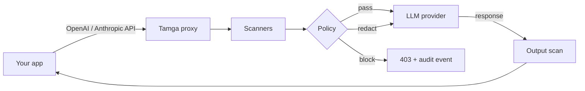
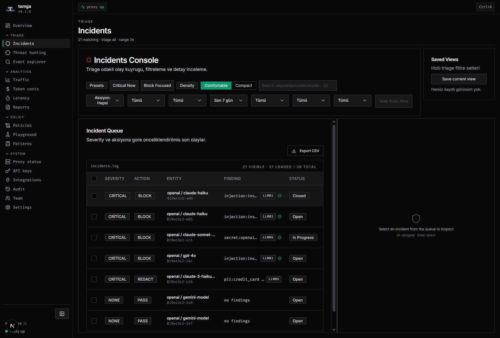

<div align="center">

<picture>
  <source media="(prefers-color-scheme: dark)" srcset="docs/logo/tamga-mark-dark.svg" />
  
</picture>

# Tamga

**Self-hosted security proxy for LLM traffic.**<br/>
Scans every prompt and response inline, and blocks or redacts PII, secrets and
prompt injection before anything leaves your network.

[](https://github.com/yatuk/tamga/actions/workflows/proxy-ci.yml)
[](CHANGELOG.md)
[](LICENSE)
[](proxy/go.mod)
[](https://github.com/yatuk/tamga/stargazers)

[Website](https://tamgaproxy.com) ·
[Quick start](#quick-start) ·
[How it works](#how-it-works) ·
[Benchmarks](#benchmarks) ·
[Docs](#documentation) ·
[Status](#project-status)


</div>

## Why Tamga

People paste customer data into LLMs every day: national IDs, IBANs, card
numbers, API keys. In regulated industries that is a reportable incident, and
the usual controls do not help:

- **Network DLP** sees an encrypted request to an API, not what the prompt says.
- **Hosted LLM gateways** inspect your prompts on *their* servers, which is the
  data transfer you were trying to avoid.
- **Provider guardrails** cover one vendor and leave no audit trail of your own.

Tamga is a reverse proxy you run yourself. It speaks the OpenAI and Anthropic
APIs, so applications only change their base URL. Built for KVKK, GDPR and
BDDK workloads, with first-class Turkish PII (TC Kimlik, Turkish IBAN and phone formats).

## Quick start

```bash
git clone https://github.com/yatuk/tamga.git
cd tamga
cp .env.example .env    # set TAMGA_MOCK_UPSTREAM=true to try it without provider keys

docker compose --env-file .env -f deploy/docker-compose.yml up -d
```

Proxy on `http://localhost:8443`, dashboard on `http://localhost:3000`.

> `--env-file .env` is required. Compose only auto-loads a `.env` next to the
> compose file, so without it the database password is empty and Postgres will
> not start.

Send a prompt carrying a Turkish national ID. It is blocked before it reaches
any provider:

```bash
curl -s -o /dev/null -w "%{http_code}\n" \
  -X POST http://localhost:8443/v1/chat/completions \
  -H "Content-Type: application/json" \
  -d '{"model":"gpt-4o-mini","messages":[{"role":"user","content":"Müşteri TC 10000000146"}]}'
# 403
```

Point an existing SDK at the proxy:

```python
import os
from openai import OpenAI

client = OpenAI(
    base_url="http://localhost:8443/v1",   # was https://api.openai.com/v1
    api_key=os.environ["OPENAI_API_KEY"],
)
```

Provider routes: `/v1` (OpenAI), `/anthropic`, `/gemini`, `/azure`, `/bedrock`,
`/mistral`, `/local`. The default policy allows the first four.

## How it works


```mermaid
flowchart LR
    A[Your app] -->|OpenAI / Anthropic API| B[Tamga proxy]
    B --> C[Scanners]
    C --> D{Policy}
    D -->|pass| E[LLM provider]
    D -->|redact| E
    D -->|block| F[403 + audit event]
    E -->|response| G[Output scan]
    G --> A
```

1. **Scan.** Deterministic scanners run in-process on every request: an
   Aho-Corasick automaton plus validators (Luhn, TCKN and IBAN checksums) and
   Unicode normalization against homoglyph and zero-width evasion.
2. **Decide.** A YAML policy maps findings to `BLOCK`, `REDACT`, `WARN` or
   `PASS`. It hot-reloads, is parsed strictly, and warns at startup if nothing
   acts on PII, secrets or injection.
3. **Forward.** Clean or redacted requests go to the provider. Responses are
   scanned on the way back.
4. **Record.** Every decision becomes an event: Postgres audit log, dashboard,
   webhooks, SIEM, OpenTelemetry.

Diagrams for the request lifecycle, scanner pipeline, policy flow and database
schema are in [docs/architecture](docs/architecture/README.md).

## What it catches

| | Detects | Default action |
|---|---|---|
| **PII** | TC Kimlik, credit cards (Luhn + BIN), IBAN, email, phone, IP | Block IDs and cards, redact the rest |
| **Secrets** | AWS, GitHub, OpenAI, Anthropic and Stripe keys, JWTs, private keys, connection strings | Block |
| **Prompt injection** | Instruction override, role manipulation, jailbreak patterns, encoded payloads; EN/TR/DE | Block |
| **Custom entities** | Your own regex patterns (customer numbers, file IDs), editable from the dashboard | Per entity |
| **System-prompt leaks** | Canary token injected into the system prompt and looked for in the response | Block (opt-in) |
| **Decision governance** | Prompts that contradict a locked decision in a [jugeni](https://github.com/jugeni/jugeni-contracts) audit log | Per assertion (opt-in) |

Also in the box: reversible PII tokenization (vault), per-key rate limits and
token budgets, provider allowlists, a response cache, and a SOC dashboard with
an incident queue. See [docs/operations.md](docs/operations.md).

<p align="center">
  
</p>

## Benchmarks

Measured on 2026-10-03. Everything here is reproducible from this repository.

**Accuracy**, deterministic scanners only, on two sets:

| Set | Prompts | Precision | Recall | F1 |
|---|---|---|---|---|
| Tuning corpus (gates CI) | 309, about 40% benign | 1.000 | 0.896 | 0.945 |
| Held-out set | 163, about half benign | 1.000 | 1.000 | 1.000 |

Read that honestly. The rules were written against the misses in the tuning
corpus, so 0.896 says how well they fit it, not how they do on new traffic; on
2026-10-01, before that work, the same corpus scored 0.969 / 0.495. The
held-out set was written separately but by the same author, in the same attack
families, so it overstates too. Expect less on your own traffic and measure
there. What the rules still miss in the corpus is semantic: fictional and
hypothetical framings, data-exfiltration requests, health data, street
addresses. An inline classifier for that gap is planned, not shipped.

**Latency.** Scan stage: p50 0.2 ms, p95 0.7–0.8 ms. End to end through the
Docker Compose stack with a mocked upstream:

| Load | P50 | P95 | P99 | Errors |
|---|---|---|---|---|
| 100 RPS | 2.4 ms | 3.8 ms | 5.2 ms | 0% |
| 500 RPS | 1.6 ms | 2.8 ms | 5.8 ms | 0% |
| 1000 RPS | 1.6 ms | 3.2 ms | 7.0 ms | 0% |

16-core laptop CPU, Docker limited to 12 GB. These depend on hardware: an
earlier run on a 4-core machine held the same P95 to 500 RPS and reached
130 ms at 1000.

**Adversarial suite.** 84 attack vectors written to evade the scanners: 78
detected, 6 bypass. Nineteen of them attack the structure of the request
rather than its wording: text in JSON escapes, in tool results, tool call
arguments, tool descriptions and attachments, and bodies that parsers read
differently. The bypasses are published in
[tests/stress/baseline.json](tests/stress/baseline.json) and include leetspeak
and character-by-character smuggling. The vectors are known to the authors, so this is a regression
suite, not an independent evaluation.

```bash
cd proxy && go run ./cmd/redteam -in ./testdata/redteam/prompts.csv   # accuracy
./tests/stress/run_stress_suite.sh                                    # adversarial + load
```

Method and per-category results: [docs/benchmarks](docs/benchmarks/README.md) ·
[tests/stress](tests/stress/README.md)

## How it compares

| | Tamga | Hosted gateways | OSS gateways | Network DLP |
|---|---|---|---|---|
| Runs entirely on your infrastructure | Yes | No | Yes | Yes |
| Turkish PII (TCKN, IBAN, phone) | Native | Partial | No | Partial |
| KVKK / BDDK control mapping | Documented | No | No | Partial |
| Inline redaction | Yes | Yes | Tier-gated | HTTPS only |
| Reversible tokenization | Yes | Partial | No | Some |
| Hash-chained audit log | Yes | No | Partial | Some |
| Published bypasses | Yes | No | No | No |
| Open source | AGPL-3.0 | No | Often MIT | Mostly no |

Tamga is a security layer, not a general LLM gateway. If you mainly need
routing, load balancing and semantic caching across many providers, a
dedicated gateway does that better; Tamga can sit in front of or behind one.
More in [docs/comparison.md](docs/comparison.md).

## Configuration

<details>
<summary><b>Policy</b> — one YAML file, hot-reloaded</summary>

```yaml
version: "1.0"
name: "default-policy"

rules:
  pii_detection:            # contact-style PII is redacted
    action: REDACT
    sensitivity: medium
    types: [iban, email, phone_tr, phone, vkn, ip_public]

  pii:                      # critical identifiers are blocked
    action: BLOCK
    sensitivity: medium
    types: [tc_kimlik, credit_card, ssn]

  secret_detection:
    action: BLOCK
    sensitivity: low

  injection:
    action: BLOCK
    sensitivity: medium

vault:                      # reversible tokenization instead of masking
  enabled: false

canary:                     # system-prompt leak detection
  enabled: false
  block_on_leak: true

providers:
  allowed: [openai, anthropic, azure, gemini]

rate_limit:
  max_requests_per_minute: 60
  max_tokens_per_day: 500000
  action_on_exceed: BLOCK
```

The shipped policy is [proxy/tamga-policy.yaml](proxy/tamga-policy.yaml). An
unknown or misplaced key is a load error, not a silent no-op.

</details>

<details>
<summary><b>Environment variables</b></summary>

| Variable | Default | Purpose |
|---|---|---|
| `TAMGA_PROXY_PORT` | `8443` | Listen port (proxy and management API) |
| `TAMGA_POLICY_PATH` | `./tamga-policy.yaml` | Policy file |
| `TAMGA_ADMIN_KEY` | — | Key for the management API |
| `TAMGA_DB_URL` | — | PostgreSQL DSN; empty disables persistence |
| `REDIS_URL` | — | Rate limiting, cache, vault store |
| `TAMGA_MOCK_UPSTREAM` | `false` | Answer with a canned response instead of calling a provider |
| `TAMGA_VAULT_KEY` | — | Base64 32-byte AES key for vault entries at rest |
| `TAMGA_TRUST_ROLE_HEADER` | `false` | Honour `X-Tamga-Role` for policy exceptions; only behind an authenticating gateway |
| `TAMGA_REQUIRE_KEY` | `false` | Refuse proxy requests that carry no valid `X-Tamga-Key` |
| `TAMGA_TRUSTED_PROXIES` | — | IPs / CIDR ranges of the load balancers allowed to set `X-Forwarded-For`. Empty: the header is ignored |
| `TAMGA_SCANNER_SERVICE_ADDR` | — | Delegate stateless scanners to a scanner-service over gRPC |
| `TAMGA_RETENTION_REQUEST_LOGS_DAYS` | `30` | How long request metadata is kept |

Full list: [docs/operations.md](docs/operations.md) · [proxy/README.md](proxy/README.md)

</details>

<details>
<summary><b>Kubernetes</b></summary>

```bash
helm install tamga ./deploy/helm/tamga-proxy -n security --create-namespace
```

No public container image is published yet: build one from `proxy/Dockerfile`,
push it to your registry, and set `image.repository` in `values.yaml`.

</details>

**What is stored.** Request metadata and masked findings, for 30 days by
default. Prompt and response bodies are not written to the database.

## Documentation

| | |
|---|---|
| [Architecture](docs/architecture/README.md) | Deployment topology, request lifecycle, scanner pipeline, schema |
| [Operations](docs/operations.md) | Configuration, vault, canary tokens, budgets, management API |
| [Compliance](docs/compliance/) | KVKK, BDDK, GDPR and OWASP LLM Top 10 mappings |
| [Benchmarks](docs/benchmarks/README.md) | Method, corpus and per-category results |
| [Development](docs/development.md) | Repository layout, local commands, tech stack |
| [Writing a scanner](docs/scanner-development.md) | Stateful scanners with request context |
| [jugeni integration](docs/integrations/jugeni.md) | Operator-state decision governance |
| [Use cases](docs/use-cases.md) · [FAQ](docs/faq.md) | Where it fits, common questions |

## Project status

Pre-1.0 and maintained by one person. Use it, test it against your own traffic,
and expect rough edges.

**Works today:** inline PII, secret and injection scanning · YAML policy with
hot reload · OpenAI- and Anthropic-compatible routes for seven providers ·
Postgres audit log · dashboard with incident queue · Docker Compose and Helm ·
Python and TypeScript SDKs.

**On `main`, not yet released (v0.9.0):** vault · canary tokens · trend graphs ·
custom entity UI · the security fixes listed in the [changelog](CHANGELOG.md).

**Known limits:**

- Recall on semantic attacks is low (see [Benchmarks](#benchmarks)).
- Scanners read the raw request body rather than individual messages, so they
  cannot yet apply different rules to system, user and tool content.
- The proxy does not authenticate callers itself and fails open if a scanner
  errors. Deploy it where only trusted applications can reach it; see
  [SECURITY.md](SECURITY.md).
- Canary detection and vault restore buffer streaming responses.

**Next:** message- and role-aware scanning · an inline classifier for semantic
injection · virtual keys with verified identity · tool-call and MCP inspection.

## Related projects

- **[jugeni](https://github.com/jugeni/jugeni-contracts)** by Mike Czerwiński —
  an operator-state framework. Tamga reads its audit log to enforce locked
  decisions before a call is made.
- **[MCPRadar](https://github.com/yatuk/mcpradar)** — a pre-deployment security
  scanner for MCP servers. Static analysis before you deploy; Tamga at runtime.

## Contributing

Issues and pull requests are welcome. Start with
[CONTRIBUTING.md](CONTRIBUTING.md); `cd proxy && go test ./...` runs the suite,
and the Postgres integration tests need Docker.

Found a way past a scanner? That is exactly what the
[adversarial suite](tests/stress/README.md) is for — open an issue or send the
vector as a pull request. For anything exploitable, follow
[SECURITY.md](SECURITY.md) instead.

## License

The proxy, scanners and dashboard are [AGPL-3.0](LICENSE). Enterprise features
(multi-region replication, SSO/SCIM, custom roles, SLA support) are offered
under a separate [commercial license](LICENSE-COMMERCIAL.md).

<div align="center">
<br/>
<sub>© 2026 Fatih Serdar Çakmak · <a href="https://tamgaproxy.com">tamgaproxy.com</a></sub>
</div>
