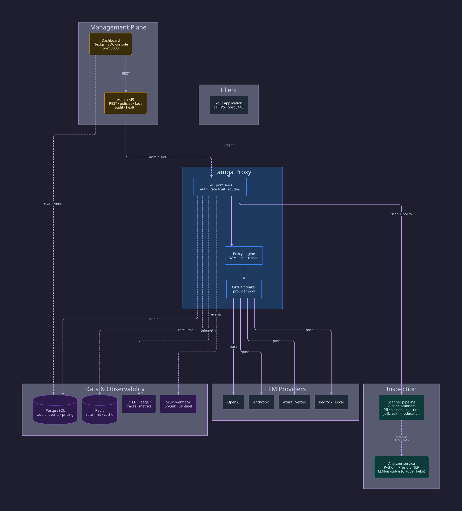
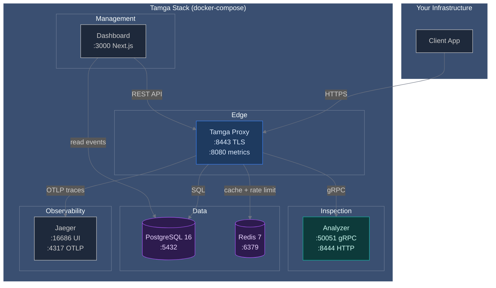
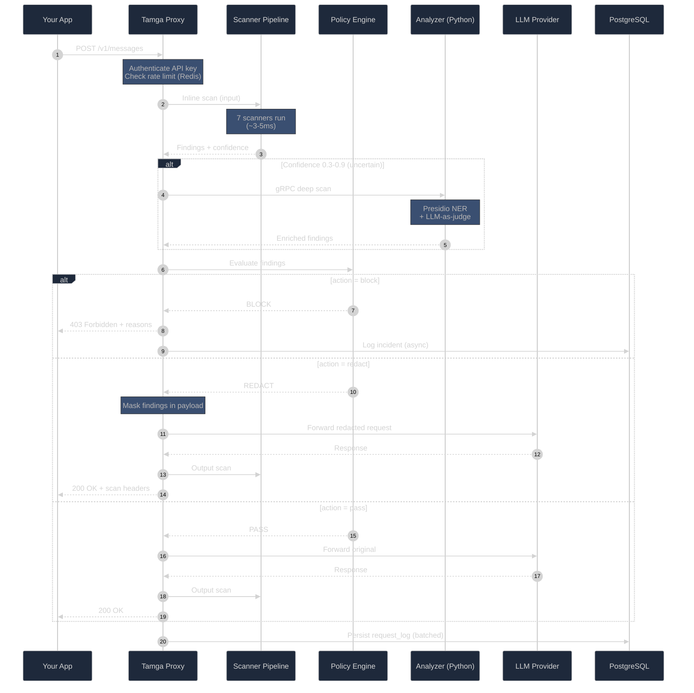
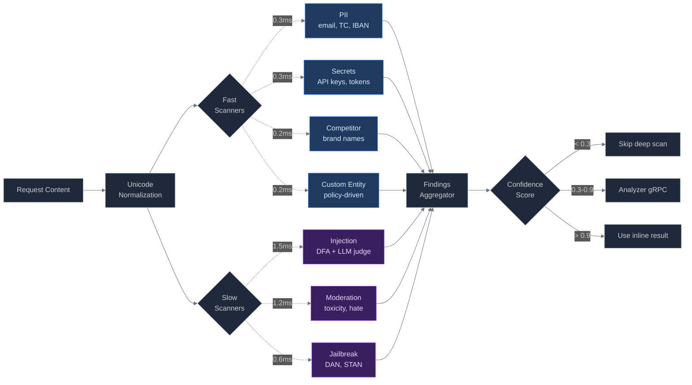
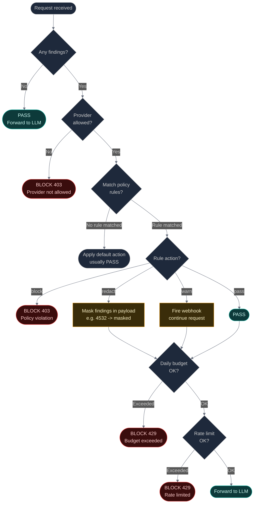
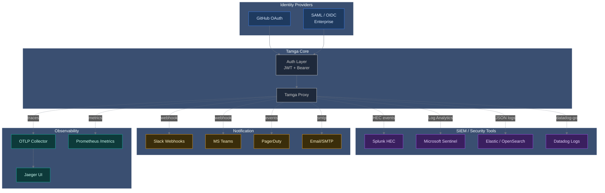
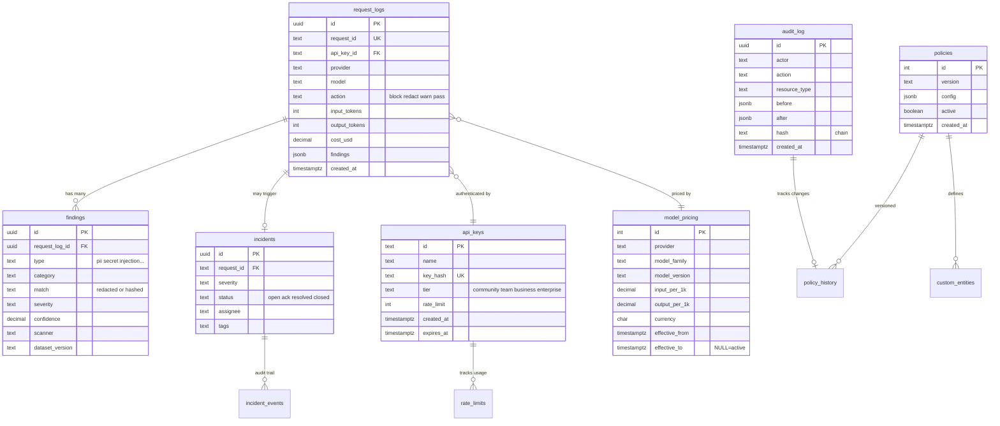

# Tamga Architecture

All architecture diagrams in one place. D2 sources and rendered SVG/PNG
versions live alongside this file.

## System overview

View the [D2 source](tamga.d2) or [full-size PNG](tamga.png).

| Component | Language | Role | Port |
|---|---|---|---|
| Proxy | Go | Inline scanners, policy engine, reverse proxy, rate limiter, REST API | `8443` |
| Analyzer | Python | Deep PII/injection/toxicity analysis, compliance reports | `8444` |
| Dashboard | Next.js | Admin UI, incident hunting, integrations, OWASP coverage | `3000` |
| PostgreSQL | — | Optional persistent telemetry and audit storage | `5432` |
| Redis | — | Rate limiting, caching, distributed counters | `6379` |
| Jaeger | — | OpenTelemetry tracing (optional) | `16686` |

## Deployment topology

Six services on an internal `tamga_default` bridge network. Only Proxy
(`:8443`) and Dashboard (`:3000`) are exposed externally; all inter-service
communication stays inside Docker's network namespace.

View the [full-size deployment diagram](deployment.svg) or [D2 source](deployment.d2).

## Request lifecycle

What happens when your app sends an LLM request through Tamga:

Scan overhead is a small fraction of total request time — provider latency
is usually 500-3000ms. See [benchmarks](../benchmarks/README.md) for
measured scan-stage numbers.

View the [D2 source](request-lifecycle.d2) or [full-size SVG](request-lifecycle.svg).

## Scanner pipeline

Seven inline scanners run on every request. Hybrid design: fast scanners
run sequentially to avoid goroutine overhead, while slower scanners run in
parallel to hide their latency.

## Policy decisions

How Tamga determines whether to block, redact, warn, or pass a request.
Decision order matters: the earliest deny wins.

Decision order (first match wins):

1. Provider allowed? Not in allowlist: BLOCK 403
2. Policy rules matched? No rule: default action
3. Rule action block (critical PII, secrets): BLOCK 403
4. Rule action redact: mask and continue
5. Rule action warn: fire webhook, pass
6. Daily budget exceeded: BLOCK 429
7. Rate limit exceeded: BLOCK 429
8. Default: PASS

## Integrations

12 pre-configured integrations. Tamga plugs into your existing security and
observability stack:

## Database schema

Tamga uses PostgreSQL 16 with 13 migrations. Core tables and their
relationships:

Retention: `request_logs` partitioned by month, default 90-day retention,
configurable per tier.
