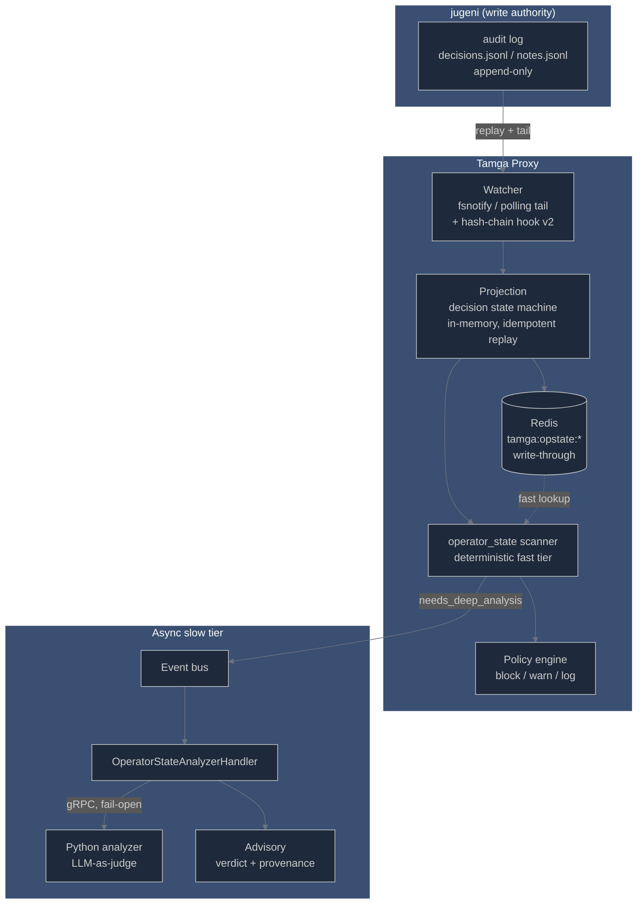

# jugeni Integration — Operator-State Scanner

Tamga's `operator_state` scanner consumes [jugeni](https://github.com/jugeni/jugeni-contracts)'s
append-only audit log as a **read-only mirror** and asserts operator-state
invariants before the LLM call proceeds: does this prompt contradict a locked
decision, has the lock gone stale, is the operator authorized for this
transition.

Contract: [jugeni-contracts v1](https://github.com/jugeni/jugeni-contracts).
jugeni remains the single write authority for decision state; Tamga never
writes to the log. Drift is bounded by the log being the contract, not the
views.

## Architecture



```
  jugeni (write authority)                Tamga proxy (read-only mirror)
 ┌──────────────────────────┐   tail    ┌─────────┐    ┌────────────┐
 │ decisions.jsonl (append) │──────────▶│ Watcher │───▶│ Projection │
 │ notes.jsonl     (append) │  replay   └─────────┘    └─────┬──────┘
 └──────────────────────────┘                     write-through│  ▲ fallback
                                                        ┌──────▼──┴───┐
                             prompt + RequestContext    │    Redis    │
                                        │               └──────┬──────┘
                                        ▼                      │ <0.8ms
                              ┌──────────────────────┐         │
                              │ operator_state scan  │◀────────┘
                              │ (deterministic tier) │
                              └──────────┬───────────┘
                                         │ findings → policy → block/warn/log
                                         │
                                         └── needs_deep_analysis ──▶ event bus
                                             └─▶ analyzer (async) ─▶ advisory
```

## What it checks

| Finding category | Trigger | Default action |
|---|---|---|
| `state_assertion_failed` | Referenced decision's state ≠ the assertion's `required_state` | per-rule (`block`/`warn`/`log`) |
| `unknown_decision_ref` | Governed decision id missing from the audit log | block (default-deny; `on_unknown_ref: allow` opts out) |
| `stale_lock` | Locked decision whose verification cadence lapsed (`LastVerifiableByFired` / last audit event older than the freshness TTL) | warn |
| `unauthorized_operator` | Request operator not on the decision's allowlist | block |
| `inactive_decision_in_active_set` | Rejected/superseded decision claimed in `X-Tamga-Active-Decisions` | block |
| `archived_note_reference` | Prompt references an archived note | log (low severity) |

**Split criterion.** Prompts that reference a decision by id (or via the
request's active set) take the deterministic path: a fast-tier lookup
(Redis first, in-memory fallback — benchmark below) with default-deny
semantics. Prompts that paraphrase their way around the lexical surface
cannot be caught deterministically; when fast-tier findings fire, they are
flagged `needs_deep_analysis` and an analyzer request is published on the
event bus. An async handler calls the Python analyzer and logs an
**advisory** (verdict + provenance) — the operator decides. Until the
analyzer ships its operator-state judge endpoint, advisories report
`inconclusive` and the deterministic tier's decision stands (fail-open).

## Setup

1. Point Tamga at jugeni's audit log:

   ```bash
   export TAMGA_OPERATOR_STATE_DECISIONS_PATH=/path/to/.jugeni/decisions/audit.jsonl
   export TAMGA_OPERATOR_STATE_NOTES_PATH=/path/to/.jugeni/notes/audit.jsonl
   # optional:
   export TAMGA_OPERATOR_STATE_POLL_INTERVAL_MS=1000   # polling fallback cadence
   export TAMGA_OPERATOR_STATE_REDIS=true              # write-through when REDIS_URL is set
   export TAMGA_OPERATOR_STATE_FORCE_POLL=1            # force polling over fsnotify
   ```

2. Enable the policy block (`proxy/tamga-policy.yaml`):

   ```yaml
   rules:
     operator_state:
       mode: confidence_based
       minimum_confidence: 0

   operator_state:
     enabled: true
     on_unknown_ref: deny
     freshness_ttl: "168h"
     assertions:
       - decision_pattern: "D-.*"
         required_state: locked
         action_on_fail: block
         severity: critical
         description: "Referenced decisions must be locked"
     authorization:
       - decision_pattern: "D-.*"
         allowed_operators: ["mike", "yatuk"]
   ```

3. Send request identity headers (all optional; jugeni-contracts v1 shape):

   | Header | Maps to | Example |
   |---|---|---|
   | `X-Tamga-Operator-Id` | `RequestContext.OperatorId` | `mike` |
   | `X-Tamga-Active-Decisions` | `RequestContext.ActiveDecisionIds` (CSV) | `D-2026-06-23-001,D-2026-06-23-004` |
   | `X-Tamga-Last-Verifiable-By` | `RequestContext.LastVerifiableByFired` (RFC3339) | `2026-07-20T06:00:00Z` |

The scanner registers automatically when at least one audit-log path is
configured. On restart Tamga replays the log from byte zero — replay is
idempotent (the projection dedups on `id|ts|action`), so no offset
persistence is needed.

## Fixture-based local test

Bundled fixtures from jugeni-contracts live at `proxy/testdata/operator_state/`
(13 decision events, 7 note events, v1 JSON schemas). To run the proxy against
them:

```bash
export TAMGA_OPERATOR_STATE_DECISIONS_PATH=proxy/testdata/operator_state/decisions.jsonl
export TAMGA_OPERATOR_STATE_NOTES_PATH=proxy/testdata/operator_state/notes.jsonl
export TAMGA_MOCK_UPSTREAM=true
go run ./proxy/cmd/tamga
```

Then exercise the adversarial vectors:

```bash
TAMGA_BASE_URL=http://localhost:8443 python tests/stress/adversarial/operator_state_bypass.py
```

Expected: 6/7 detected, 1 expected bypass (the paraphrased-contradiction
vector — semantic tier territory). The Go test suite covers the same path
end-to-end without a live proxy:

```bash
cd proxy && go test ./internal/scanner/operator_state/...
```

## Fast-tier latency

Benchmarks (`go test -bench BenchmarkOperatorStateScan -benchmem -run '^$'
./internal/scanner/operator_state/`, Intel Core Ultra 7 255H, 1k projected
decisions, 3 refs per prompt) against the <0.8ms budget:

| Path | ns/op | allocs/op |
|---|---|---|
| In-memory projection | ~954 | 5 |
| Mock Redis (map-backed) | ~8,200 | 68 |

Production Redis adds deployment-dependent round-trip time; on miss or error
the scanner falls back to the in-memory projection.

## Limitations

- **In-proxy only for now.** The standalone `scanner-service` gRPC binary does
  not run this scanner: its `ScanRequest` proto has no operator-context fields
  and the service carries no watcher/Redis state. When `TAMGA_SCANNER_SERVICE_ADDR`
  routes scans to the remote service, operator-state findings are absent from
  remote results (the local registry only runs as a fallback on gRPC error).
  Threading `RequestContext` through the proto `metadata` map is a planned
  follow-up.
- **Semantic judge is follow-up scope.** The async route publishes analyzer
  requests today; the Python analyzer's operator-state endpoint ships
  separately, so advisories are `inconclusive` until then.
- **Hash chain is a v1 no-op.** The watcher already routes every entry through
  `HashChainVerifier.Verify` (and parses v2 `prev_hash`/`entry_hash` fields),
  but validation logic lands with the v2 contract.
- **Single audit-log path pair per instance.** Multi-project deployments run
  one Tamga per jugeni log.
