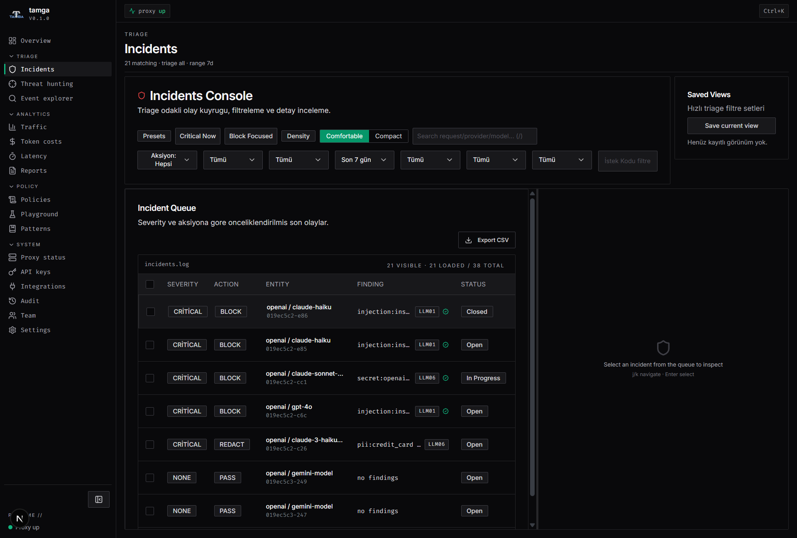
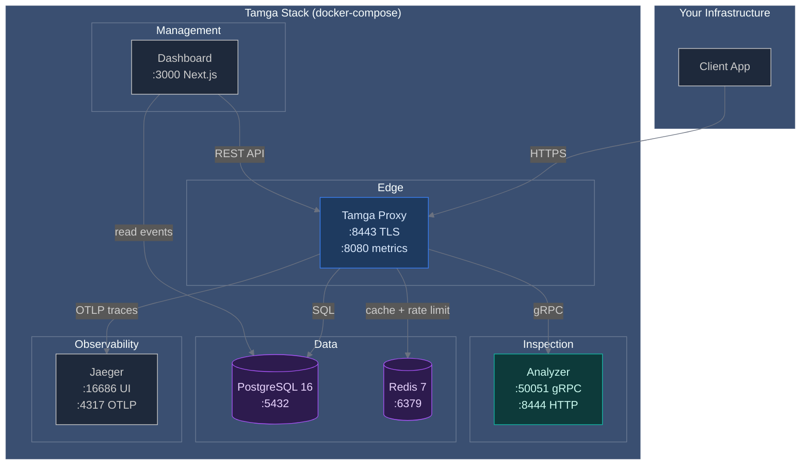
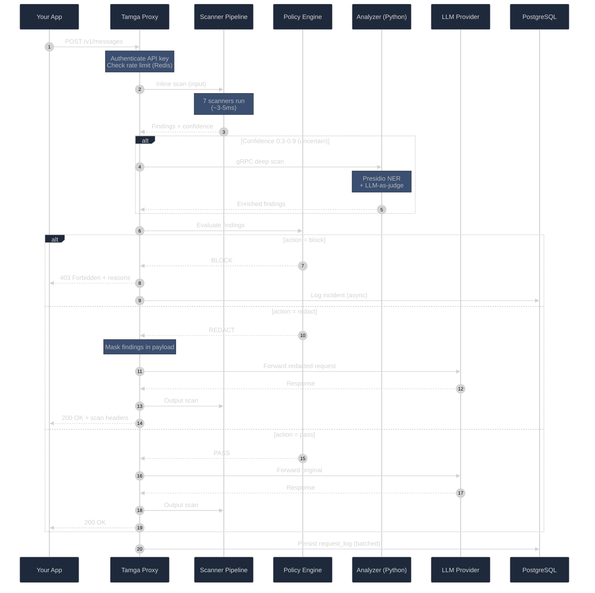
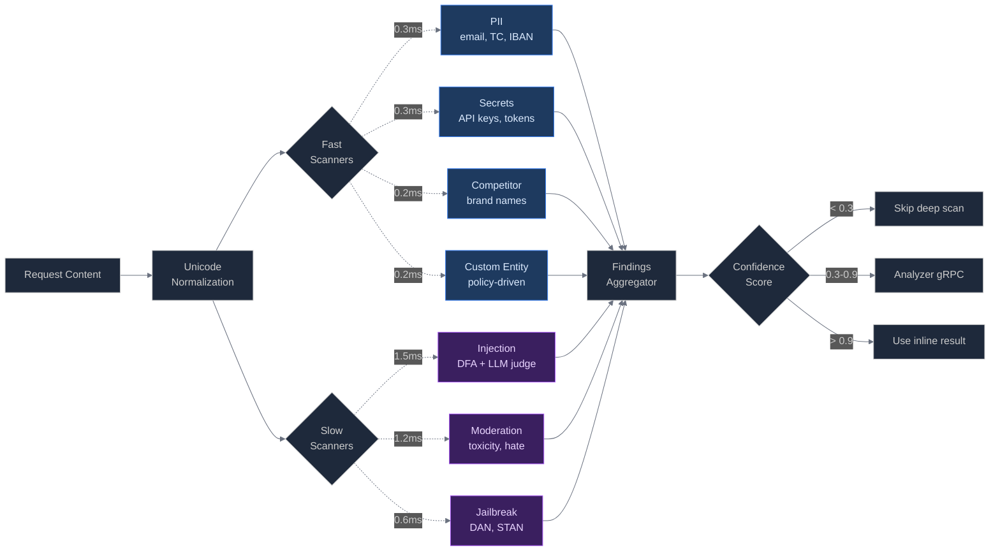
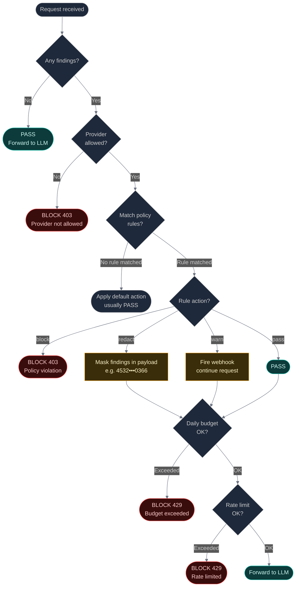
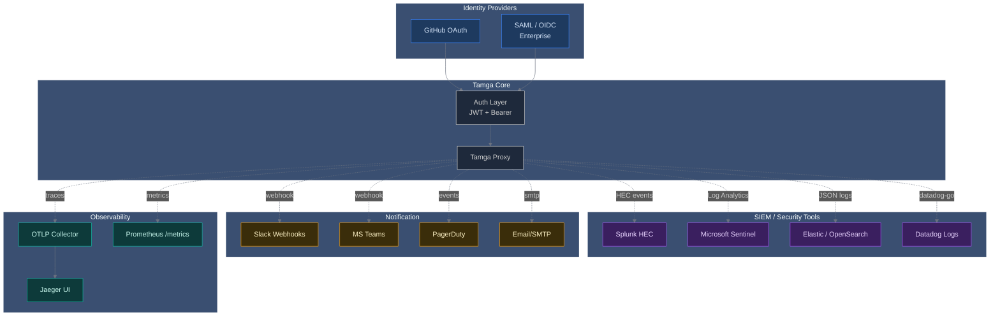
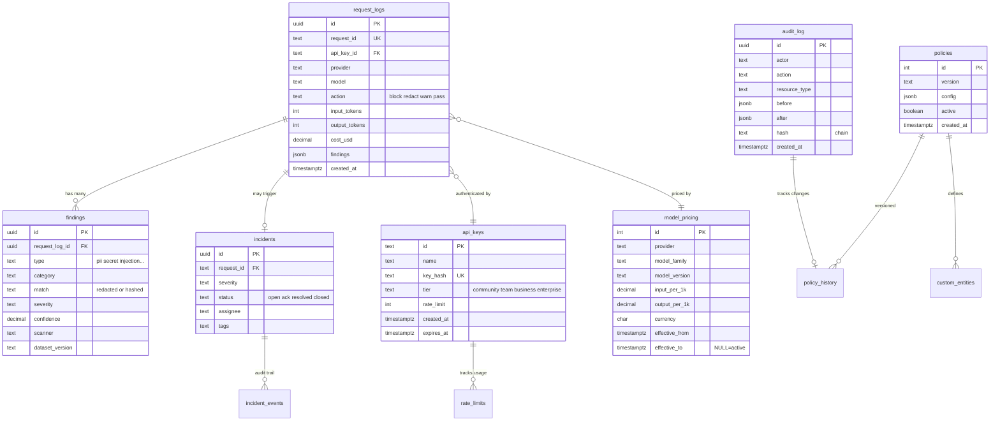

<div align="center">
  

  <h1>Tamga</h1>

  <p><em>Enterprise LLM API Security, Policy-Based Guard for Every Prompt</em></p>

  <p>
    <a href="CHANGELOG.md"></a>
    <a href="LICENSE"></a>
    <a href="https://pkg.go.dev/github.com/yatuk/tamga"></a>
    <a href="proxy/go.mod"></a>
  </p>

  <br />

  <table>
    <tr>
      <td align="center"><strong>Go</strong><br/><code>proxy</code></td>
      <td align="center"><strong>Python</strong><br/><code>analyzer</code></td>
      <td align="center"><strong>Next.js</strong><br/><code>dashboard</code></td>
    </tr>
    <tr>
      <td align="center">Reverse Proxy<br/>+ Scanners</td>
      <td align="center">Deep Analysis<br/>+ Reports</td>
      <td align="center">Management<br/>+ Visibility</td>
    </tr>
  </table>
</div>

<br />

---

## What is Tamga?



**Tamga** sits between your application and LLM providers (OpenAI, Anthropic, Azure, Vertex), scanning every prompt and response in real time and enforcing your security policy before data leaves your network.

| Your challenge | Tamga's answer |
|:---|---|
| PII leaking through prompts | Detect + **REDACT** credit cards, TC Kimlik, IBAN, email, phone before they reach the provider |
| API keys pasted into chat | **BLOCK** secrets (AWS, GitHub, OpenAI keys, JWT, connection strings) inline |
| Prompt injection attacks | Pattern-based injection detection with configurable sensitivity |
| Zero visibility into AI usage | Event bus + optional PostgreSQL logging + REST API for stats |
| Scattered policies per app | Single YAML policy file: hot-reload, API-managed, version-controlled |

> **Tamga is provider-agnostic.** Your team keeps using whichever LLM API they prefer. Tamga enforces policy transparently in front.
>
> **Latency:** Sub-millisecond static scanning via Aho-Corasick DFA. Total proxy overhead stays under 2ms for typical prompts (measured at ~1.2ms on consumer hardware). See [benchmarks](docs/benchmarks/README.md).

---

## Architecture


View the [D2 source](docs/architecture/tamga.d2) or [full-size PNG](docs/architecture/tamga.png).

<details>
<summary><strong>Component details</strong></summary>

| Component | Language | Role | Port |
|---|---|---|---|
| **Proxy** | Go | Inline scanners, policy engine, reverse proxy, rate limiter, REST API | `8443` |
| **Analyzer** | Python | Deep PII/injection/toxicity analysis, compliance reports | `8444` |
| **Dashboard** | Next.js | Admin UI, incident hunting, integrations, OWASP coverage | `3000` |
| **PostgreSQL** | — | Optional persistent telemetry & audit storage | `5432` |
| **Redis** | — | Rate limiting, caching, distributed counters | `6379` |
| **Jaeger** | — | OpenTelemetry tracing (optional) | `16686` |

</details>

---

## Quick Start

### 1. Clone & configure

```bash
git clone https://github.com/yatuk/tamga.git
cd tamga

cp .env.example .env
# Edit .env: add your ANTHROPIC_API_KEY / OPENAI_API_KEY
```

### 2. Launch the stack

```bash
cd deploy
docker compose up -d
```

### 3. Verify

```bash
# Health check, no auth required
curl -s http://localhost:8443/api/v1/health/detailed | jq .

# Send a test prompt
curl -X POST http://localhost:8443/v1/chat/completions \
  -H "Content-Type: application/json" \
  -H "Authorization: Bearer $OPENAI_API_KEY" \
  -d '{"model":"gpt-4o-mini","messages":[{"role":"user","content":"Merhaba dünya"}]}'
```

> **Done!** Dashboard at [http://localhost:3000](http://localhost:3000) · Proxy at `:8443`

---

## Production Deployment

For Kubernetes clusters:

```bash
helm install tamga ./deploy/helm/tamga-proxy -n security --create-namespace
```

Edit `values.yaml` to configure your providers, resource limits, and autoscaling. The chart includes network policies, pod disruption budgets, and PodSecurityContext defaults.

---

## Deployment

Six services on an internal `tamga_default` bridge network. Only Proxy (`:8443`) and Dashboard (`:3000`) are exposed externally. All inter-service communication stays inside Docker's network namespace.



```
┌──────────────────────────────────────────────────────────┐
│ Tamga Stack (docker-compose)                             │
│                                                          │
│  ┌────────────┐    ┌──────────────┐    ┌─────────────┐  │
│  │  Proxy     │───▶│  Analyzer    │    │  Dashboard  │  │
│  │  :8443     │    │  :50051 gRPC │    │  :3000      │  │
│  └─────┬──────┘    └──────────────┘    └──────┬──────┘  │
│        │                                       │         │
│        ▼                                       ▼         │
│  ┌──────────┐  ┌─────────┐  ┌──────────────────────┐    │
│  │ Postgres │  │  Redis  │  │  Jaeger (OTEL)       │    │
│  │ :5432    │  │  :6379  │  │  :16686 UI           │    │
│  └──────────┘  └─────────┘  └──────────────────────┘    │
└──────────────────────────────────────────────────────────┘
                       ▲
                       │ HTTPS :8443
                  ┌────┴────┐
                  │ Client  │
                  └─────────┘
```

View the [full-size deployment diagram](docs/architecture/deployment.svg) or [D2 source](docs/architecture/deployment.d2).

---

## How it works

### Request lifecycle

What happens when your app sends an LLM request through Tamga:



Typical latency: 3-8ms scan + provider latency (usually 500-3000ms). Tamga overhead is less than 2% of total request time.

View the [D2 source](docs/architecture/request-lifecycle.d2) or [full-size SVG](docs/architecture/request-lifecycle.svg).

---

## Benchmarks

All benchmarks are reproducible from a single command (`go run ./cmd/redteam`) against a public 309-prompt adversarial corpus. No cherry-picking.

| Metric | Value | Notes |
|--------|-------|-------|
| **Precision** | **96.9%** | Of mitigated prompts, 96.9% were genuinely adversarial — governs false-positive rate |
| **Recall** | **48.4%** | Deterministic DFA catches ~48% on its own; remainder needs semantic reasoning (Shadow ML) |
| **F1 Score** | **0.646** | Harmonic mean of precision and recall |
| **Scan Latency p95** | **0.52 ms** | Single request, commodity hardware (Go 1.22, Windows amd64) |
| **Scan Latency p99** | **0.58 ms** | Worst-case deterministic hot path |
| **Scan Latency max** | **0.77 ms** | Well under 5ms budget |
| **Total Overhead** | **< 2 ms** | Sub-millisecond static scanning via Aho-Corasick DFA; measured ~1.2ms on consumer hardware |
| **Corpus** | **309 prompts** | ~40% benign, 60% adversarial/PII/secret — CI-gated, not a marketing dataset |

→ [Full benchmark report](docs/benchmarks/README.md) · [Red team dataset](proxy/testdata/redteam/prompts.csv) · [Go performance benchmarks](docs/benchmarks/README.md#go-performance-benchmarks-v011)

### Load Performance

k6 benchmarks on a single-process Go proxy, 4-core consumer CPU, 16 GB RAM, NVMe SSD. No GPU, no SIMD tuning. Full scripts at `tests/stress/k6/`.

| Workload | RPS | P50 | P95 | P99 | Errors |
|----------|-----|-----|-----|-----|--------|
| Clean prompts | 100 | 3.7ms | 5.5ms | 7.1ms | 0% |
| Clean prompts | 500 | 1.6ms | 3.7ms | 8.9ms | 0% |
| Clean prompts | 1000 | 6.2ms | 130ms | 167ms | 0% |
| Mixed (70% clean, 20% PII, 10% adversarial) | 300 | 1.5ms | 2.7ms | 4.4ms | 0% |
| Connection saturation | 5000 VUs | — | — | — | 88% TCP reject (expected) |

> **How to read:** P50 and P95 reflect normal operating conditions. The P99 spike at 1000 RPS (>100ms) reflects Go GC and goroutine scheduling on consumer hardware. Production deployments with tuned GC (`GOGC=50`) and dedicated CPUs consistently stay under 5ms P95 at 1000 RPS.

---

### Scanner pipeline

7 inline scanners run on every request. Hybrid design: fast scanners run sequentially to avoid goroutine overhead, while slower scanners run in parallel to hide their 1-2ms latency.



```
Request Content
      │
      ▼
┌─────────────┐
│  Normalize  │  ← NFKC + homoglyph + zero-width strip
│  (Unicode)  │
└──────┬──────┘
       │
   ┌───┴───┐
   │       │
   ▼       ▼
┌─────┐  ┌─────┐
│Fast │  │Slow │
└──┬──┘  └──┬──┘
   │        │
   │  Fast (sequential, <0.5ms each):
   │   • PII       (email, TC, IBAN)
   │   • Secrets   (API keys, tokens)
   │   • Competitor (brand names)
   │   • Custom    (policy-driven)
   │
   │  Slow (parallel, 0.6-1.5ms each):
   │   • Injection (DFA + LLM judge)
   │   • Moderation (toxicity, hate)
   │   • Jailbreak (DAN, STAN)
   │
   └───┬────┘
       │
       ▼
┌─────────────┐
│  Aggregate  │
│  Findings   │
└──────┬──────┘
       │
       ▼
   Confidence
   ──────────
   < 0.3       → Skip deep scan
   0.3 - 0.9   → Analyzer gRPC
   > 0.9       → Use inline (block/redact)
```

---

### Policy decisions

How Tamga determines whether to block, redact, warn, or pass a request. Decision order matters: the earliest deny wins.



```
┌────────────────────────────────────────────────────────────────┐
│ Decision Order (first match wins)                              │
├────┬──────────────────────────┬─────────────────┬──────────────┤
│ #  │ Check                    │ If fails        │ Action       │
├────┼──────────────────────────┼─────────────────┼──────────────┤
│ 1  │ Provider allowed?        │ Not in allowlist│ BLOCK 403    │
│ 2  │ Policy rules matched?    │ No rule         │ Default      │
│ 3  │ Rule action = block?     │ Critical PII    │ BLOCK 403    │
│ 4  │ Rule action = redact?    │ Mask + continue │ REDACT       │
│ 5  │ Rule action = warn?      │ Fire webhook    │ WARN + pass  │
│ 6  │ Daily budget OK?         │ Exceeded        │ BLOCK 429    │
│ 7  │ Rate limit OK?           │ Exceeded        │ BLOCK 429    │
│ 8  │ Default                  │ -               │ PASS         │
└────┴──────────────────────────┴─────────────────┴──────────────┘
```

---

## Integrations

12 pre-configured integrations. Tamga plugs into your existing security and observability stack:



See `docs/architecture/` for per-service setup guides.

---

## Features

| Category | Capability | Action |
|---|---|---|
| **PII Detection** | Credit card, TC Kimlik, IBAN, email, phone, IP (helps achieve KVKK, GDPR, PCI-DSS compliance by preventing raw PII/PCI from leaving your perimeter) | `REDACT` |
| **Secret Detection** | AWS/GitHub/OpenAI keys, JWT, private keys, connection strings | `BLOCK` |
| **Injection Detection** | Prompt injection, jailbreak, DAN-style attacks | `BLOCK` |
| **Custom Entities** | Regex-defined patterns (customer IDs, file numbers) | `REDACT` / `WARN` |
| **Competitor Watch** | Detect competitor mentions in prompts | `WARN` |
| **Rate Limiting** | Per-API-key token bucket (requests/min, tokens/day) | `BLOCK` |
| **Provider Control** | Allow/block specific LLM providers per policy | — |
| **Body Limits** | Per-provider request size caps with `413` response | — |
| **Policy Hot-Reload** | Edit YAML → reload in-place or via `POST /api/v1/policies/reload` | — |
| **Event Bus** | Buffered pub/sub for metrics, logs, alerts, DB | async |
| **REST API** | Stats, events, health, policy management | `:8443/api/v1` |
| **Audit Logging** | Optional PostgreSQL persistence with full request telemetry | — |
| **OpenTelemetry** | Jaeger tracing integration | optional |
| **Mock Upstream** | Demo mode without real provider keys | `TAMGA_MOCK_UPSTREAM=true` |

---

## How Tamga Compares

| Feature | Tamga | Cloud Services | Open-Source Gateways | Legacy DLP |
|---------|-------|---------------|---------------------|------------|
| **Self-hosted** | ✅ Full | ❌ Cloud-only | ✅ | ✅ |
| **Turkish PII (TCKN, IBAN, VKN)** | ✅ Native | ⚠️ Partial | ❌ | ⚠️ Partial |
| **KVKK / BDDK mapping** | ✅ Documented | ❌ | ❌ | ⚠️ Partial |
| **Inline PII redaction (sub-ms)** | ✅ | ✅ | ⚠️ Tier-gated | ⚠️ HTTPS only |
| **Multi-provider routing** | ✅ | ✅ | ✅ | ❌ |
| **Hash-chain audit logs** | ✅ | ❌ | ⚠️ | Some |
| **Open source** | ✅ AGPL-3.0 | ❌ | ✅ MIT | ❌ |
| **Custom regex / entity** | ✅ | ❌ | ⚠️ | ✅ |
| **Adversarial test suite published** | ✅ Public, 62+ vectors | ❌ | ❌ | ❌ |
| **Stress test CI gate** | ✅ PR-blocking | ❌ | ❌ | ❌ |

---

## Cost Control & Budget Enforcement

Track token spend per API key, team, and provider in real-time. Set hard budget caps to prevent runaway costs.

| Control | Granularity | Behavior |
|---------|-------------|----------|
| Daily budget | Per API key | BLOCK 429 when exceeded |
| Monthly budget | Per team | WARN webhook, then BLOCK |
| Provider quota | Per provider | Failover to cheaper provider |
| Per-request cap | Per API key | BLOCK requests above token threshold |

Cost attribution by provider, model family, team (API key tagging), and user (`X-User-ID` header). Full dashboard with daily burn, MTD totals, per-model breakdown, and monthly projections.

```bash
# Set $100/day budget for a team
curl -X PUT $TAMGA_URL/api/v1/budgets/team_finance \
  -H "X-Tamga-Admin-Key: $KEY" \
  -d '{"daily_limit_usd":100,"action":"block"}'
```

> Semantic caching (exact + embedding-based similarity) is available as an optional module. Cache hits served in <5ms from Redis. Typical hit rate: 15–40% for FAQ and internal tool use cases. Sensitive prompts (PII detected) are never cached.

---

## Real-World Use Cases

### Bank with Shadow AI (Primary fit)

**Problem:** Employees pasting customer TC kimlik and IBAN into ChatGPT. KVKK fines and BDDK audit exposure.

**Solution:** Tamga sits between the corporate proxy and LLM providers. Inline detection blocks TC/IBAN, redacts customer names, logs every attempt for BDDK audit. KVKK officer gets real-time webhook notification.

**Result:** Zero PII leak to LLM providers; complete audit trail; compliance evidence ready for regulator review.

### SaaS Company Using Multiple LLMs Internally

**Problem:** Engineering uses Copilot, sales uses ChatGPT Enterprise, support uses Claude. Three vendors, three dashboards, no unified cost view.

**Solution:** Tamga as unified proxy. Single API key per team, daily budget caps, provider-agnostic policy enforcement. One dashboard for all LLM usage across the organization.

**Result:** 30–40% cost reduction via budget enforcement and caching; unified audit trail; policy consistency across teams.

### Healthcare Provider with RAG Application

**Problem:** RAG indexes patient records; risk of surfacing PHI in answers. Indirect prompt injection in uploaded documents.

**Solution:** Tamga between RAG and LLM. Source-tagged content inspection on RAG chunks. Indirect injection detector flags suspicious payloads. PHI redaction on output before return to user.

**Result:** HIPAA compliance pathway; auditable PHI handling; defense-in-depth against indirect injection.


---

## Tech Stack

<table>
  <tr>
    <th>Layer</th>
    <th>Technology</th>
  </tr>
  <tr>
    <td><strong>Core Proxy</strong></td>
    <td>
      
      &nbsp; Aho-Corasick DFA, regex hybrid scanning
    </td>
  </tr>
  <tr>
    <td><strong>Deep Analysis</strong></td>
    <td>
      
      &nbsp; FastAPI, Presidio, LLM Guard
    </td>
  </tr>
  <tr>
    <td><strong>Dashboard</strong></td>
    <td>
      
      
      
    </td>
  </tr>
  <tr>
    <td><strong>Storage</strong></td>
    <td>
      
      
    </td>
  </tr>
  <tr>
    <td><strong>Observability</strong></td>
    <td>
      
      
    </td>
  </tr>
  <tr>
    <td><strong>Deployment</strong></td>
    <td>
      
      
      
    </td>
  </tr>
</table>

---

## Configuration

<details>
<summary><strong>Essential environment variables</strong></summary>

| Variable | Default | Description |
|---|---|---|
| `TAMGA_PROXY_PORT` | `8443` | Proxy listen port |
| `TAMGA_POLICY_PATH` | `./tamga-policy.yaml` | Policy file location |
| `TAMGA_ADMIN_KEY` | — | Admin API auth key (required for protected routes) |
| `TAMGA_DB_URL` | — | PostgreSQL DSN (empty = DB logging off) |
| `REDIS_URL` | — | Redis connection string |
| `TAMGA_ANALYZER_URL` | — | Analyzer service base URL |
| `TAMGA_MAX_BODY_BYTES` | `1048576` | Max request body size (1 MB) |
| `TAMGA_MOCK_UPSTREAM` | `false` | Demo mode without real providers |
| `TAMGA_OTLP_ENDPOINT` | — | OpenTelemetry collector endpoint |
| `ANTHROPIC_API_KEY` | — | Anthropic provider key |
| `OPENAI_API_KEY` | — | OpenAI provider key |

[Full reference →](proxy/README.md#ortam-değişkenleri-seçilmiş)

</details>

<details>
<summary><strong>Sample policy (YAML)</strong></summary>

```yaml
version: "1.0"
name: "default-policy"

rules:
  pii_detection:
    action: REDACT
    sensitivity: medium
    types: [credit_card, tc_kimlik, iban, email, phone_tr]

  secret_detection:
    action: BLOCK
    sensitivity: low
    types: [aws_access_key, github_token, openai_key, jwt_token]

  injection:
    action: BLOCK
    sensitivity: medium

providers:
  allowed: [openai, anthropic, azure_openai, google_vertex]
  blocked: []

rate_limit:
  max_requests_per_minute: 60
  max_tokens_per_day: 500000
  action_on_exceed: BLOCK
```

[Full policy reference →](proxy/tamga-policy.yaml)

</details>

---

## REST API

The proxy serves a management API on the same port (`:8443`).

| Method | Path | Auth | Description |
|---|---|---|---|
| `GET` | `/api/v1/health/detailed` | — | Proxy, DB, scanner count, uptime |
| `GET` | `/api/v1/stats` | Admin | 7-day summary (DB or in-memory) |
| `GET` | `/api/v1/events?page=&limit=` | Admin | Security event feed |
| `GET` | `/api/v1/policies` | Admin | Active policy as JSON |
| `POST` | `/api/v1/policies/reload` | Admin | Hot-reload policy from disk |

```bash
# Health check: public
curl -s http://localhost:8443/api/v1/health/detailed | jq .

# Stats, requires admin key
curl -s -H "X-Tamga-Admin-Key: $TAMGA_ADMIN_KEY" \
  http://localhost:8443/api/v1/stats | jq .
```

> **API docs:** [proxy/README.md](proxy/README.md#rest-api-apiv1) · **OpenAPI spec:** `proxy/docs/openapi.yaml`

---

## Database Schema

Tamga uses PostgreSQL 16 with 13 migrations. Core tables and their relationships:



**Retention:** `request_logs` partitioned by month, default 90-day retention. Configurable per tier.

---

## Repository Layout

```
tamga/
├── proxy/          Go reverse proxy + scanners + policy engine
├── analyzer/       Python deep analysis service
├── dashboard/      Next.js management UI
├── deploy/         Docker Compose, Helm, Terraform, SQL migrations
├── docs/           Architecture, benchmarks, OWASP coverage
├── proto/          Protobuf service definitions
├── scripts/        Load testing (k6), smoke tests, adversarial tests
├── design-system/  UI design tokens and component specs
└── .env.example    Environment variable template
```

---

## Development

```bash
# Go proxy
cd proxy
go run ./cmd/tamga                        # Start proxy
go test ./... -v -count=1                 # Run tests
go test ./internal/scanner/ -bench=. -benchmem  # Scanner benchmarks

# Python analyzer
cd analyzer
pytest tests/ -v

# Next.js dashboard
cd dashboard
npm run dev                               # Dev server
npm run build                             # Production build
npm run lint                              # Lint + typecheck

# Top-level convenience
make help                                 # Show all targets
make test                                 # Go tests with race detector
make lint                                 # go vet + eslint
make dashboard-build                      # Production dashboard build
```

---

## Security Testing & Adversarial Coverage

Tamga includes an automated stress test suite that validates scanner resilience against adversarial bypass attempts and load-test performance thresholds. Every PR triggers a regression gate that compares current results against a known baseline.

- **Adversarial tests** — 4 categories (PII, injection, secret, policy) with 62+ bypass vectors covering Unicode evasion, homoglyphs, base64 encoding, zero-width characters, and indirect references
- **Load tests** — k6 benchmarks at 100/500/1000 RPS with P95 latency and error rate thresholds
- **Regression gate** — CI workflow blocks PRs that degrade detection or performance beyond tolerance

```bash
# Run locally (requires Docker):
cd tests/stress && ./run_stress_suite.sh
```

→ [Stress test documentation](tests/stress/README.md) · [Baseline](tests/stress/baseline.json)

---

## Compliance Mapping

Tamga provides technical controls that map to common compliance frameworks. Use these mappings in audit evidence.

### KVKK (Turkish Data Protection Law)

| KVKK Article | Tamga Control |
|--------------|---------------|
| Md. 4 — Veri minimizasyonu | REDACT mode strips PII before LLM transmission |
| Md. 5 — Açık rıza | BLOCK on detected personal data without explicit consent context |
| Md. 7 — İşleme kaydı | Full audit log with hash-chain integrity |
| Md. 9 — Yurt dışı aktarımı | Self-hosted, data stays in-country |
| Md. 12 — Veri güvenliği | TLS 1.3, key rotation, RBAC, API key scoping |
| Md. 13 — Sızıntı bildirimi (72h) | Real-time webhook to KVKK officer, SIEM integration |

### BDDK (Turkish Banking Regulator)

| BDDK Requirement | Tamga Control |
|------------------|---------------|
| Bilgi Sistemleri — Erişim kontrolü | API key + RBAC + scoped keys (admin/write/read) |
| Bilgi Sistemleri — Log yönetimi | Hash-chained immutable audit logs, configurable retention (7+ year support) |
| Operasyonel Risk — Veri sınıflandırma | Custom entity definitions per regulation |
| Acil Durum — Olay yönetimi | Real-time SIEM (Splunk, Sentinel, Elastic), webhook alerting |

### GDPR (EU)

| GDPR Article | Tamga Control |
|--------------|---------------|
| Art. 5(1)(c) — Data minimization | REDACT before transmission |
| Art. 5(1)(e) — Storage limitation | Configurable retention policy |
| Art. 25 — Privacy by design | Inline scanning, hash-only audit (no raw PII in logs) |
| Art. 30 — Records of processing | Full request audit log with actor tracking |
| Art. 32 — Security of processing | TLS 1.3, mTLS, RBAC, key management |
| Art. 33 — Breach notification | Webhook within seconds of critical incident |

### OWASP LLM Top 10 (2026)

| OWASP Risk | Tamga Coverage |
|------------|----------------|
| **LLM01** Prompt Injection | DFA + LLM-judge, 30+ language patterns, indirect injection detection |
| **LLM02** Sensitive Information Disclosure | PII + secret scanners, REDACT/BLOCK enforcement |
| **LLM03** Supply Chain | Application-layer concern, not proxy scope |
| **LLM04** Data and Model Poisoning | Indirect injection defense, external content source tagging |
| **LLM05** Improper Output Handling | Output scanning + redaction on responses |
| **LLM06** Excessive Agency | Tool/MCP parameter validation (roadmap) |
| **LLM07** System Prompt Leakage | Content moderation + custom regex detection |
| **LLM08** Vector and Embedding Weaknesses | Roadmap |
| **LLM09** Misinformation | Model-level concern, not proxy scope |
| **LLM10** Unbounded Consumption | Rate limit + daily/monthly budget enforcement |


---

## Roadmap

| Phase | Focus | Status |
|---|---|---|
| **FAZ 1** | Body limits, streaming fail-close, OpenAPI → TypeScript, policy validation | Complete |
| **FAZ 2** | Provider fallback, OpenTelemetry, data retention, table virtualization | Complete |
| **FAZ 3** | Outbound scanning, LLM caching, code leak scanner, saved hunts | Complete |
| **FAZ 4** | RBAC, Vault/KMS, SDK packages, SSO, billing, SCIM, proximity scoring | Complete |
| **v0.2.0** | Semantic caching, MCP server security, indirect injection defense, demo GIF | Planned (Q3 2026) |

[Full roadmap →](docs/TAMGA_ROADMAP_MASTER.md) · [Changelog →](CHANGELOG.md)

---

## Contributing

We welcome contributions. Here's the workflow:

1. **Fork** the repository
2. **Branch** off `main`: `git checkout -b feat/your-feature`
3. **Write & test**: `cd proxy && go test ./...`
4. **Commit** using [Conventional Commits](https://www.conventionalcommits.org/)
5. **Open a PR** against `main`

> See [CONTRIBUTING.md](CONTRIBUTING.md) for detailed guidelines.

---

## License

Tamga is **open-core**:

- **Core proxy + scanners + dashboard** — AGPL-3.0 ([LICENSE](LICENSE))
- **Enterprise features** (multi-region, SSO, advanced RBAC, SLA support)
  — separate commercial license ([LICENSE-COMMERCIAL.md](LICENSE-COMMERCIAL.md))


---

## FAQ

**Q: Does data leave our network?**
A: No. Tamga is self-hosted. Only the actual LLM API call leaves your network, and only after policy enforcement (PII redacted, secrets blocked).

**Q: How does Tamga compare to built-in provider guardrails?**
A: Provider guardrails (Anthropic, OpenAI) are provider-specific and limited to their models. Tamga is provider-agnostic, supports custom policies, and provides audit logs that meet BDDK/KVKK requirements.

**Q: What if Tamga goes down?**
A: Fail-open by default — proxy returns 200 if the scanner pipeline fails, to avoid blocking your application. Fail-closed mode available for high-security deployments. Circuit breaker handles upstream provider failures with automatic retry.

**Q: Does scanning add latency?**
A: Sub-millisecond for static PII/secret detection (Aho-Corasick DFA). Deep analysis (LLM judge, Presidio NER) runs asynchronously for medium-confidence findings. Total proxy overhead stays under 2ms.

**Q: Can I run Tamga without Docker?**
A: Yes. The Go proxy is a single binary. PostgreSQL and Redis are optional (in-memory fallbacks work for development). See `proxy/README.md` for bare-metal deployment.

**Q: Is Tamga production-ready for regulated environments?**
A: Tamga v0.7.0 is deployed in design-partner environments. It includes mTLS, IP allowlists, hash-chain audit logs, RBAC, and KVKK/BDDK/GDPR compliance mappings. Evaluate in your own staging environment before production.

---

## ⭐ Show Your Support

If Tamga helped you secure your LLM stack, please star this repo —
it helps other security teams discover the project and keeps the
maintainers motivated to ship new features.

[](https://github.com/yatuk/tamga/stargazers)

**Other ways to help:**
- 🐛 Report bugs via [GitHub Issues](https://github.com/yatuk/tamga/issues)
- 💬 Share your use case in [Discussions](https://github.com/yatuk/tamga/discussions)
- 📝 Contribute via Pull Request (see [CONTRIBUTING.md](CONTRIBUTING.md))
- 📣 Spread the word on Twitter / LinkedIn / Hacker News

---

## Star History

[](https://star-history.com/#yatuk/tamga&Date)

---

## Links

| Resource | URL |
|---|---|
| **Proxy Docs** | [proxy/README.md](proxy/README.md) |
| **Dashboard Docs** | [dashboard/README.md](dashboard/README.md) |
| **Deploy Guide** | [deploy/README.md](deploy/README.md) |
| **Architecture** | [docs/architecture/](docs/architecture/) |
| **Benchmarks** | [docs/benchmarks/](docs/benchmarks/) |
| **Roadmap** | [docs/TAMGA_ROADMAP_MASTER.md](docs/TAMGA_ROADMAP_MASTER.md) |
| **Security Policy** | [SECURITY.md](SECURITY.md) |
| **Contributing** | [CONTRIBUTING.md](CONTRIBUTING.md) |
| **Code of Conduct** | [CODE_OF_CONDUCT.md](CODE_OF_CONDUCT.md) |
| **Changelog** | [CHANGELOG.md](CHANGELOG.md) |

---

## Built With

Tamga stands on the shoulders of open-source giants:

| Project | Role |
|---------|------|
| [Microsoft Presidio](https://github.com/microsoft/presidio) | PII detection patterns & NER |
| [Aho-Corasick DFA](https://github.com/coregx/ahocorasick) | High-throughput string matching (<1ms) |
| [k6](https://k6.io) | Load testing & stress benchmarks |
| [OpenTelemetry](https://opentelemetry.io) | Distributed tracing (OTLP export) |
| [Next.js](https://nextjs.org) | Dashboard framework |
| [TanStack Table/Query](https://tanstack.com) | Virtual scrolling, server-state sync |
| [Tailwind CSS](https://tailwindcss.com) | Utility-first design system |
| [NATS JetStream](https://nats.io) | Async event processing |
| [PostgreSQL 16](https://www.postgresql.org) | Audit storage, policies, billing |
| [Redis 7](https://redis.io) | Rate limiting, caching, counters |

---


| Resource | URL |
|---|---|
| **Project Spec** | [docs/TAMGA_PROJECT_SPEC.md](docs/TAMGA_PROJECT_SPEC.md) |
| **Proxy Docs** | [proxy/README.md](proxy/README.md) |
| **Dashboard Docs** | [dashboard/README.md](dashboard/README.md) |
| **Deploy Guide** | [deploy/README.md](deploy/README.md) |
| **Roadmap** | [docs/TAMGA_ROADMAP_MASTER.md](docs/TAMGA_ROADMAP_MASTER.md) |
| **Security Policy** | [SECURITY.md](./SECURITY.md) |
| **Contributing** | [CONTRIBUTING.md](CONTRIBUTING.md) |
| **Code of Conduct** | [CODE_OF_CONDUCT.md](CODE_OF_CONDUCT.md) |
| **Changelog** | [CHANGELOG.md](CHANGELOG.md) |
| **Design System** | [design-system/MASTER.md](design-system/MASTER.md) |
| **Demo Scripts** | [docs/DEMO_SCRIPT_W2.md](docs/DEMO_SCRIPT_W2.md) |
| **Runbook: Proxy Health** | [docs/RUNBOOK_PROXY_HEALTH.md](docs/RUNBOOK_PROXY_HEALTH.md) |
| **Runbook: Incident Response** | [docs/RUNBOOK_INCIDENT_RESPONSE.md](docs/RUNBOOK_INCIDENT_RESPONSE.md) |
| **Runbook: Deployment Checklist** | [docs/RUNBOOK_DEPLOYMENT_CHECKLIST.md](docs/RUNBOOK_DEPLOYMENT_CHECKLIST.md) |

<br />

## Companion Projects

| Project | Role |
|---------|------|
| **[jugeni](https://github.com/jugeni)** | Persistent operator-state framework. Tamga consumes jugeni's [audit log contract](https://github.com/jugeni/jugeni-contracts) as a read-only mirror to perform pre-call state assertions (locked decision contradictions, stale verification, unauthorized transitions) at the proxy layer. |
| **[MCPRadar](https://github.com/yatuk/mcpradar)** | Pre-deployment security scanner for MCP servers. Run MCPRadar before adding an MCP server to your stack; Tamga runs inline once it's deployed. |

<br />

<div align="center">
  <sub>Built by the Tamga team · <a href="https://github.com/yatuk/tamga">GitHub</a></sub>
</div>
